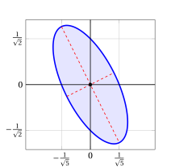
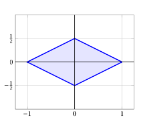

# Norme

**Esercizi · Norme** · capitolo [5 · Norme](../norme/01-norme.md) · con le soluzioni svolte · [:material-file-pdf-box: PDF](../pdf/es-norme-01-norme.pdf)

!!! esercizio "Esercizio 1"

    Calcolare le norme \(\ell_1\), \(\ell_2\) e \(\ell_\infty\) dei seguenti vettori colonna:

    $$
    {\boldsymbol p} = \begin{pmatrix} 2 \\ -3 \\ 6 \end{pmatrix} \in \R^3,
    \qquad
    {\boldsymbol w} = \begin{pmatrix} 4 \\ 0 \\ -3 \end{pmatrix} \in \R^3,
    \qquad
    {\boldsymbol u} = \begin{pmatrix} 1 \\ -1 \\ 1 \\ -1 \end{pmatrix} \in \R^4
    $$

    Per ciascun vettore, verificare che \(\|\cdot\|_\infty \le \|\cdot\|_2 \le \|\cdot\|_1\).

??? soluzione "Soluzione"

    Usando le definizioni, si ha:

    \begin{align*}
    &\|{\boldsymbol p}\|_1 = |2| + |-3| + |6| = 11, &&
    \|{\boldsymbol p}\|_2 = \sqrt{4 + 9 + 36} = 7, &&
    \|{\boldsymbol p}\|_\infty = \max\{2, 3, 6\} = 6 \\[1ex]
    &\|{\boldsymbol w}\|_1 = |4| + |0| + |-3| = 7, &&
    \|{\boldsymbol w}\|_2 = \sqrt{16 + 0 + 9} = 5, &&
    \|{\boldsymbol w}\|_\infty = \max\{4, 0, 3\} = 4 \\[1ex]
    &\|{\boldsymbol u}\|_1 = 1 + 1 + 1 + 1 = 4, &&
    \|{\boldsymbol u}\|_2 = \sqrt{1 + 1 + 1 + 1} = 2, &&
    \|{\boldsymbol u}\|_\infty = \max\{1, 1, 1, 1\} = 1
    \end{align*}

    Di conseguenza:

    $$
    6 \le 7 \le 11, \qquad 4 \le 5 \le 7, \qquad 1 \le 2 \le 4
    $$

!!! esercizio "Esercizio 2"

    Consideriamo i vettori colonna

    $$
    {\boldsymbol p} = \begin{pmatrix} 1 \\ 2 \\ -1 \end{pmatrix} \in \R^3
    \qquad \text{e} \qquad
    {\boldsymbol w} = \begin{pmatrix} 3 \\ -1 \\ 5 \end{pmatrix} \in \R^3
    $$

    Calcolare la distanza tra \({\boldsymbol p}\) e \({\boldsymbol w}\) misurata con le norme \(\ell_1\), \(\ell_2\) e \(\ell_\infty\), cioè \(\|{\boldsymbol p} - {\boldsymbol w}\|_1\), \(\|{\boldsymbol p} - {\boldsymbol w}\|_2\) e \(\|{\boldsymbol p} - {\boldsymbol w}\|_\infty\). Spiegare poi perché \(\|{\boldsymbol w} - {\boldsymbol p}\| = \|{\boldsymbol p} - {\boldsymbol w}\|\) per ogni norma.

??? soluzione "Soluzione"

    La differenza dei due vettori è

    $$
    {\boldsymbol p} - {\boldsymbol w} = \begin{pmatrix} 1 - 3 \\ 2 - (-1) \\ -1 - 5 \end{pmatrix} = \begin{pmatrix} -2 \\ 3 \\ -6 \end{pmatrix}
    $$

    quindi:

    $$
    \|{\boldsymbol p} - {\boldsymbol w}\|_1 = 2 + 3 + 6 = 11, \quad
    \|{\boldsymbol p} - {\boldsymbol w}\|_2 = \sqrt{4 + 9 + 36} = 7, \quad
    \|{\boldsymbol p} - {\boldsymbol w}\|_\infty = \max\{2, 3, 6\} = 6
    $$

    Poiché \({\boldsymbol w} - {\boldsymbol p} = (-1) \, ({\boldsymbol p} - {\boldsymbol w})\), per l'omogeneità assoluta (con \(\lambda = -1\)) si ottiene, per ogni norma,

    $$
    \|{\boldsymbol w} - {\boldsymbol p}\| = |-1| \; \|{\boldsymbol p} - {\boldsymbol w}\| = \|{\boldsymbol p} - {\boldsymbol w}\|
    $$

!!! esercizio "Esercizio 3"

    Consideriamo il vettore colonna

    $$
    {\boldsymbol p} = \begin{pmatrix} 2 \\ -1 \\ 2 \end{pmatrix} \in \R^3
    $$

    1. Trovare il vettore \({\boldsymbol u}\) con la stessa direzione e lo stesso verso di \({\boldsymbol p}\) tale che \(\|{\boldsymbol u}\|_2 = 1\) (cioè normalizzare \({\boldsymbol p}\) rispetto alla norma \(\ell_2\)) e verificare il risultato.

    2. Normalizzare \({\boldsymbol p}\) rispetto alla norma \(\ell_1\) e rispetto alla norma \(\ell_\infty\).

    3. Spiegare perché il vettore nullo non può essere normalizzato.

??? soluzione "Soluzione"

    1. Si ha \(\|{\boldsymbol p}\|_2 = \sqrt{4 + 1 + 4} = 3\). Per qualsiasi norma, il vettore \({\boldsymbol u} = \frac{1}{\|{\boldsymbol p}\|} \, {\boldsymbol p}\) ha, per l'omogeneità assoluta, \(\|{\boldsymbol u}\| = \frac{1}{\|{\boldsymbol p}\|} \|{\boldsymbol p}\| = 1\). Quindi

        $$
        {\boldsymbol u} = \frac{1}{3} \begin{pmatrix} 2 \\ -1 \\ 2 \end{pmatrix} = \begin{pmatrix} \frac{2}{3} \\[0.5ex] -\frac{1}{3} \\[0.5ex] \frac{2}{3} \end{pmatrix},
        \qquad
        \|{\boldsymbol u}\|_2 = \sqrt{\frac{4}{9} + \frac{1}{9} + \frac{4}{9}} = \sqrt{1} = 1
        $$

    2. Si ha \(\|{\boldsymbol p}\|_1 = 2 + 1 + 2 = 5\) e \(\|{\boldsymbol p}\|_\infty = 2\), quindi

        $$
        \frac{1}{5} \, {\boldsymbol p} = \begin{pmatrix} \frac{2}{5} \\[0.5ex] -\frac{1}{5} \\[0.5ex] \frac{2}{5} \end{pmatrix}, \quad \left\|\frac{1}{5} \, {\boldsymbol p}\right\|_1 = \frac{2}{5} + \frac{1}{5} + \frac{2}{5} = 1,
        \qquad
        \frac{1}{2} \, {\boldsymbol p} = \begin{pmatrix} 1 \\[0.5ex] -\frac{1}{2} \\[0.5ex] 1 \end{pmatrix}, \quad \left\|\frac{1}{2} \, {\boldsymbol p}\right\|_\infty = 1
        $$

    3. Per la definitezza, \(\|{\boldsymbol 0}\| = 0\), quindi non si può dividere per essa. Inoltre, \(\|\lambda \, {\boldsymbol 0}\| = \|{\boldsymbol 0}\| = 0 \neq 1\) per ogni \(\lambda \in \R\).

!!! esercizio "Esercizio 4"

    Consideriamo i vettori colonna

    $$
    {\boldsymbol p} = \begin{pmatrix} 1 \\ 2 \\ 2 \end{pmatrix} \in \R^3
    \qquad \text{e} \qquad
    {\boldsymbol w} = \begin{pmatrix} 2 \\ -2 \\ 1 \end{pmatrix} \in \R^3
    $$

    1. Verificare la disuguaglianza triangolare \(\|{\boldsymbol p} + {\boldsymbol w}\| \le \|{\boldsymbol p}\| + \|{\boldsymbol w}\|\) per le norme \(\ell_1\), \(\ell_2\) e \(\ell_\infty\).

    2. Verificare la disuguaglianza triangolare inversa \(\big|\|{\boldsymbol p}\|_2 - \|{\boldsymbol w}\|_2\big| \le \|{\boldsymbol p} - {\boldsymbol w}\|_2\).

??? soluzione "Soluzione"

    Si ha

    $$
    {\boldsymbol p} + {\boldsymbol w} = \begin{pmatrix} 3 \\ 0 \\ 3 \end{pmatrix},
    \qquad
    {\boldsymbol p} - {\boldsymbol w} = \begin{pmatrix} -1 \\ 4 \\ 1 \end{pmatrix}
    $$

    1. - \(\ell_1\): \(\|{\boldsymbol p}\|_1 = 5\), \(\|{\boldsymbol w}\|_1 = 5\), \(\|{\boldsymbol p} + {\boldsymbol w}\|_1 = 6\), e \(6 \le 5 + 5 = 10\).

        - \(\ell_2\): \(\|{\boldsymbol p}\|_2 = \sqrt{1 + 4 + 4} = 3\), \(\|{\boldsymbol w}\|_2 = \sqrt{4 + 4 + 1} = 3\), \(\|{\boldsymbol p} + {\boldsymbol w}\|_2 = \sqrt{9 + 0 + 9} = 3\sqrt{2} \approx 4.243\), e \(3\sqrt{2} \le 3 + 3 = 6\).

        - \(\ell_\infty\): \(\|{\boldsymbol p}\|_\infty = 2\), \(\|{\boldsymbol w}\|_\infty = 2\), \(\|{\boldsymbol p} + {\boldsymbol w}\|_\infty = 3\), e \(3 \le 2 + 2 = 4\).

    2. \(\|{\boldsymbol p} - {\boldsymbol w}\|_2 = \sqrt{1 + 16 + 1} = \sqrt{18} = 3\sqrt{2}\), e

        $$
        \big|\|{\boldsymbol p}\|_2 - \|{\boldsymbol w}\|_2\big| = |3 - 3| = 0 \le 3\sqrt{2}
        $$

!!! esercizio "Esercizio 5"

    Consideriamo i vettori colonna

    $$
    {\boldsymbol p} = \begin{pmatrix} 1 \\ 2 \\ 3 \end{pmatrix},
    \qquad
    {\boldsymbol w} = \begin{pmatrix} 4 \\ -5 \\ 6 \end{pmatrix},
    \qquad
    {\boldsymbol u} = \begin{pmatrix} -2 \\ -4 \\ -6 \end{pmatrix}
    $$

    Verificare la disuguaglianza di Cauchy–Schwarz \(|{\boldsymbol p}' \, {\boldsymbol w}| \le \|{\boldsymbol p}\|_2 \, \|{\boldsymbol w}\|_2\) per la coppia \({\boldsymbol p}, {\boldsymbol w}\) e per la coppia \({\boldsymbol p}, {\boldsymbol u}\). In quale caso vale l'uguaglianza?

??? soluzione "Soluzione"

    Si ha \(\|{\boldsymbol p}\|_2 = \sqrt{1 + 4 + 9} = \sqrt{14}\).

    - Coppia \({\boldsymbol p}, {\boldsymbol w}\): \({\boldsymbol p}' \, {\boldsymbol w} = 4 - 10 + 18 = 12\) e \(\|{\boldsymbol w}\|_2 = \sqrt{16 + 25 + 36} = \sqrt{77}\), quindi

        $$
        |{\boldsymbol p}' \, {\boldsymbol w}| = 12 \le \sqrt{14} \, \sqrt{77} = \sqrt{1078} \approx 32.83
        $$

        La disuguaglianza è stretta.

    - Coppia \({\boldsymbol p}, {\boldsymbol u}\): \({\boldsymbol p}' \, {\boldsymbol u} = -2 - 8 - 18 = -28\) e \(\|{\boldsymbol u}\|_2 = \sqrt{4 + 16 + 36} = \sqrt{56} = 2\sqrt{14}\), quindi

        $$
        |{\boldsymbol p}' \, {\boldsymbol u}| = 28 = \sqrt{14} \cdot 2\sqrt{14} = \|{\boldsymbol p}\|_2 \, \|{\boldsymbol u}\|_2
        $$

        Vale l'uguaglianza: infatti \({\boldsymbol u} = -2 \, {\boldsymbol p}\), cioè \({\boldsymbol u}\) è un multiplo scalare di \({\boldsymbol p}\).

!!! esercizio "Esercizio 6"

    Consideriamo i punti di \(\R^2\)

    $$
    {\boldsymbol a} = \begin{pmatrix} \frac{1}{2} \\[0.5ex] \frac{1}{2} \end{pmatrix},
    \qquad
    {\boldsymbol b} = \begin{pmatrix} \frac{3}{5} \\[0.5ex] \frac{4}{5} \end{pmatrix},
    \qquad
    {\boldsymbol c} = \begin{pmatrix} 1 \\[0.5ex] -1 \end{pmatrix},
    \qquad
    {\boldsymbol d} = \begin{pmatrix} 0 \\[0.5ex] -1 \end{pmatrix}
    $$

    1. Descrivere e disegnare le palle unitarie \(\{{\boldsymbol x} \in \R^2 : \|{\boldsymbol x}\| \le 1\}\) delle norme \(\ell_1\), \(\ell_2\) e \(\ell_\infty\).

    2. Per ciascun punto, stabilire se si trova all'interno, sul bordo o all'esterno di ciascuna delle tre palle unitarie.

??? soluzione "Soluzione"

    1. La palla unitaria \(\ell_1\), \(|x_1| + |x_2| \le 1\), è un rombo (un quadrato ruotato di 45°) con vertici \((\pm 1, 0)\) e \((0, \pm 1)\); la palla unitaria \(\ell_2\), \(x_1^2 + x_2^2 \le 1\), è il cerchio delimitato dalla circonferenza unitaria; la palla unitaria \(\ell_\infty\), \(\max\{|x_1|, |x_2|\} \le 1\), è il quadrato con lati paralleli agli assi e vertici \((\pm 1, \pm 1)\).

        { .fig loading=lazy style="width:36%" }

    2. Calcoliamo le tre norme di ciascun punto (valore \(< 1\): interno; \(= 1\): sul bordo; \(> 1\): esterno):

        
<table>
        <tr>
        <td></td>
        <td>\(\ell_1\)</td>
        <td>\(\ell_2\)</td>
        <td>\(\ell_\infty\)</td>
        </tr>
        <tr>
        <td>\({\boldsymbol a}\)</td>
        <td>\(1\) (bordo)</td>
        <td>\(\frac{\sqrt{2}}{2} \approx 0.707\) (interno)</td>
        <td>\(\frac{1}{2}\) (interno)</td>
        </tr>
        <tr>
        <td>\({\boldsymbol b}\)</td>
        <td>\(\frac{7}{5}\) (esterno)</td>
        <td>\(\sqrt{\frac{9}{25} + \frac{16}{25}} = 1\) (bordo)</td>
        <td>\(\frac{4}{5}\) (interno)</td>
        </tr>
        <tr>
        <td>\({\boldsymbol c}\)</td>
        <td>\(2\) (esterno)</td>
        <td>\(\sqrt{2}\) (esterno)</td>
        <td>\(1\) (bordo)</td>
        </tr>
        <tr>
        <td>\({\boldsymbol d}\)</td>
        <td>\(1\) (bordo)</td>
        <td>\(1\) (bordo)</td>
        <td>\(1\) (bordo)</td>
        </tr>
        </table>

!!! esercizio "Esercizio 7"

    Consideriamo la matrice

    $$
    {\boldsymbol Q} = \begin{pmatrix} 5 & 2 \\[0.5ex] 2 & 2 \end{pmatrix} \in \R^{2 \times 2}
    $$

    1. Usando la definizione, dimostrare che \({\boldsymbol Q}\) è definita positiva, così che \(\|{\boldsymbol x}\|_{\boldsymbol Q} = \sqrt{{\boldsymbol x}' \, {\boldsymbol Q} \, {\boldsymbol x}}\) è una norma su \(\R^2\).

    2. Calcolare \(\|{\boldsymbol p}\|_{\boldsymbol Q}\), \(\|{\boldsymbol w}\|_{\boldsymbol Q}\) e \(\|{\boldsymbol p} + {\boldsymbol w}\|_{\boldsymbol Q}\) per \( {\boldsymbol p} = \begin{pmatrix} 1 \\ 0 \end{pmatrix} \) e \( {\boldsymbol w} = \begin{pmatrix} 0 \\ 1 \end{pmatrix} \).

    3. Verificare la disuguaglianza triangolare e la disuguaglianza di Cauchy–Schwarz generalizzata per \({\boldsymbol p}\) e \({\boldsymbol w}\).

??? soluzione "Soluzione"

    1. \({\boldsymbol Q}\) è simmetrica e, per ogni \({\boldsymbol x} \in \R^2\),

        $$
        {\boldsymbol x}' \, {\boldsymbol Q} \, {\boldsymbol x} = 5x_1^2 + 4x_1x_2 + 2x_2^2 = x_1^2 + (2x_1 + x_2)^2 + x_2^2 \ge 0
        $$

        La somma di quadrati è nulla solo se \(x_1 = 0\) e \(x_2 = 0\); quindi \({\boldsymbol x}' \, {\boldsymbol Q} \, {\boldsymbol x} > 0\) per ogni \({\boldsymbol x} \neq {\boldsymbol 0}\), cioè \({\boldsymbol Q}\) è definita positiva, e \(\|\cdot\|_{\boldsymbol Q}\) è una norma \(\ell_2\) generalizzata.

    2. Usando \(\|{\boldsymbol x}\|_{\boldsymbol Q}^2 = 5x_1^2 + 4x_1x_2 + 2x_2^2\):

        $$
        \|{\boldsymbol p}\|_{\boldsymbol Q} = \sqrt{5}, \qquad
        \|{\boldsymbol w}\|_{\boldsymbol Q} = \sqrt{2}, \qquad
        \|{\boldsymbol p} + {\boldsymbol w}\|_{\boldsymbol Q} = \left\| \begin{pmatrix} 1 \\ 1 \end{pmatrix} \right\|_{\boldsymbol Q} = \sqrt{5 + 4 + 2} = \sqrt{11}
        $$

    3. Disuguaglianza triangolare: \(\sqrt{11} \approx 3.317 \le \sqrt{5} + \sqrt{2} \approx 2.236 + 1.414 = 3.650\).

        Disuguaglianza di Cauchy–Schwarz generalizzata: \({\boldsymbol p}' \, {\boldsymbol Q} \, {\boldsymbol w} = q_{12} = 2\), e

        $$
        |{\boldsymbol p}' \, {\boldsymbol Q} \, {\boldsymbol w}| = 2 \le \sqrt{5} \, \sqrt{2} = \sqrt{10} \approx 3.162
        $$

        Si noti che, rispetto al prodotto scalare standard, gli stessi vettori sono ortogonali (\({\boldsymbol p}' \, {\boldsymbol w} = 0\)), mentre \({\boldsymbol p}' \, {\boldsymbol Q} \, {\boldsymbol w} \neq 0\).

!!! esercizio "Esercizio 8"

    Consideriamo di nuovo la matrice simmetrica definita positiva \( {\boldsymbol Q} = \begin{pmatrix} 5 & 2 \\ 2 & 2 \end{pmatrix} \).

    1. Calcolare gli autovalori e gli autovettori di \({\boldsymbol Q}\).

    2. Descrivere l'ellisse \(\{{\boldsymbol x} \in \R^2 : {\boldsymbol x}' \, {\boldsymbol Q} \, {\boldsymbol x} = 1\}\): i suoi semiassi (lunghezze e direzioni), gli estremi dei semiassi e le intersezioni con gli assi coordinati. Disegnare l'insieme \(\{{\boldsymbol x} \in \R^2 : \|{\boldsymbol x}\|_{\boldsymbol Q} \le 1\}\).

??? soluzione "Soluzione"

    1. L'equazione caratteristica è

        $$
        \det({\boldsymbol Q} - \lambda {\boldsymbol I}) = (5 - \lambda)(2 - \lambda) - 4 = \lambda^2 - 7\lambda + 6 = (\lambda - 1)(\lambda - 6) = 0
        $$

        quindi \(\lambda_1 = 1\) e \(\lambda_2 = 6\) (entrambi positivi, come atteso). Gli autovettori corrispondenti sono

        $$
        {\boldsymbol v}_1 = \begin{pmatrix} 1 \\ -2 \end{pmatrix} \quad \left({\boldsymbol Q} \, {\boldsymbol v}_1 = \begin{pmatrix} 1 \\ -2 \end{pmatrix} = 1 \cdot {\boldsymbol v}_1\right),
        \qquad
        {\boldsymbol v}_2 = \begin{pmatrix} 2 \\ 1 \end{pmatrix} \quad \left({\boldsymbol Q} \, {\boldsymbol v}_2 = \begin{pmatrix} 12 \\ 6 \end{pmatrix} = 6 \, {\boldsymbol v}_2\right)
        $$

    2. L'ellisse \(5x_1^2 + 4x_1x_2 + 2x_2^2 = 1\) è centrata nell'origine e ruotata (i suoi assi principali sono le direzioni di \({\boldsymbol v}_1\) e \({\boldsymbol v}_2\), non gli assi coordinati).

        - Semiasse lungo \({\boldsymbol v}_1\): lunghezza \(\frac{1}{\sqrt{\lambda_1}} = 1\), estremi \(\pm \frac{{\boldsymbol v}_1}{\|{\boldsymbol v}_1\|_2} = \pm \left(\frac{1}{\sqrt{5}}, -\frac{2}{\sqrt{5}}\right)\).

        - Semiasse lungo \({\boldsymbol v}_2\): lunghezza \(\frac{1}{\sqrt{\lambda_2}} = \frac{1}{\sqrt{6}}\), estremi \(\pm \frac{1}{\sqrt{6}} \frac{{\boldsymbol v}_2}{\|{\boldsymbol v}_2\|_2} = \pm \left(\frac{2}{\sqrt{30}}, \frac{1}{\sqrt{30}}\right)\).

        - Intersezioni con gli assi: per \(x_2 = 0\), \(5x_1^2 = 1\), cioè \(\left(\pm \frac{1}{\sqrt{5}}, 0\right)\); per \(x_1 = 0\), \(2x_2^2 = 1\), cioè \(\left(0, \pm \frac{1}{\sqrt{2}}\right)\).

        Ad esempio, \(\left(\frac{1}{\sqrt{5}}, -\frac{2}{\sqrt{5}}\right)\) appartiene all'ellisse: \(5 \cdot \frac{1}{5} + 4 \cdot \left(-\frac{2}{5}\right) + 2 \cdot \frac{4}{5} = 1\).

        { .fig loading=lazy style="width:36%" }

!!! esercizio "Esercizio 9"

    Dimostrare che, per ogni vettore colonna \({\boldsymbol x} \in \R^n\),

    $$
    \|{\boldsymbol x}\|_2 \le \sqrt{n} \; \|{\boldsymbol x}\|_\infty
    \qquad \text{e} \qquad
    \|{\boldsymbol x}\|_\infty \le \|{\boldsymbol x}\|_1
    $$

    Per quali vettori vale l'uguaglianza in ciascuna disuguaglianza?

??? soluzione "Soluzione"

    - Poiché \(x_j^2 = |x_j|^2 \le \|{\boldsymbol x}\|_\infty^2\) per ogni \(j \in \{1,2,\ldots,n\}\), si ha

        $$
        \|{\boldsymbol x}\|_2^2 = \sum_{j=1}^n x_j^2 \le \sum_{j=1}^n \|{\boldsymbol x}\|_\infty^2 = n \, \|{\boldsymbol x}\|_\infty^2
        $$

        e, estraendo la radice quadrata di entrambi i membri (non negativi), \(\|{\boldsymbol x}\|_2 \le \sqrt{n} \, \|{\boldsymbol x}\|_\infty\). L'uguaglianza vale se e solo se \(x_j^2 = \|{\boldsymbol x}\|_\infty^2\) per ogni \(j\), cioè se tutte le componenti hanno lo stesso valore assoluto (ad esempio \({\boldsymbol x} = (1, -1, 1, -1)'\) dell'Esercizio [Esercizio 1](#box-exe_norms_compute-1): \(2 = \sqrt{4} \cdot 1\)).

    - Sia \(k\) un indice tale che \(|x_k| = \|{\boldsymbol x}\|_\infty\). Allora

        $$
        \|{\boldsymbol x}\|_\infty = |x_k| \le |x_k| + \sum_{j \neq k} |x_j| = \|{\boldsymbol x}\|_1
        $$

        L'uguaglianza vale se e solo se \(\sum_{j \neq k} |x_j| = 0\), cioè se \({\boldsymbol x}\) ha al più una componente non nulla.

!!! esercizio "Esercizio 10"

    Siano \({\boldsymbol p}, {\boldsymbol w} \in \R^n\) con \({\boldsymbol w} \neq {\boldsymbol 0}\). Dimostrare che nella disuguaglianza di Cauchy–Schwarz vale l'uguaglianza, cioè

    $$
    |{\boldsymbol p}' \, {\boldsymbol w}| = \|{\boldsymbol p}\|_2 \, \|{\boldsymbol w}\|_2
    $$

    se e solo se \({\boldsymbol p} = \lambda \, {\boldsymbol w}\) per qualche scalare \(\lambda \in \R\).

    <em>Suggerimento</em>: usare il vettore \({\boldsymbol u} = \alpha \, {\boldsymbol p} + \beta \, {\boldsymbol w}\), con \(\alpha = {\boldsymbol w}' \, {\boldsymbol w}\) e \(\beta = -{\boldsymbol p}' \, {\boldsymbol w}\), introdotto nella dimostrazione della disuguaglianza di Cauchy–Schwarz.

??? soluzione "Soluzione"

    - **(\(\Leftarrow\))** Se \({\boldsymbol p} = \lambda \, {\boldsymbol w}\), allora

        $$
        |{\boldsymbol p}' \, {\boldsymbol w}| = |\lambda \, {\boldsymbol w}' \, {\boldsymbol w}| = |\lambda| \, \|{\boldsymbol w}\|_2^2
        \qquad \text{e} \qquad
        \|{\boldsymbol p}\|_2 \, \|{\boldsymbol w}\|_2 = |\lambda| \, \|{\boldsymbol w}\|_2 \, \|{\boldsymbol w}\|_2 = |\lambda| \, \|{\boldsymbol w}\|_2^2
        $$

    - **(\(\Rightarrow\))** Come visto nella dimostrazione della disuguaglianza di Cauchy–Schwarz, con \(\alpha = {\boldsymbol w}' \, {\boldsymbol w}\) e \(\beta = -{\boldsymbol p}' \, {\boldsymbol w}\) si ha

        $$
        \|{\boldsymbol u}\|_2^2 = {\boldsymbol u}' \, {\boldsymbol u} = {\boldsymbol w}' \, {\boldsymbol w} \left( ({\boldsymbol w}' \, {\boldsymbol w}) \, ({\boldsymbol p}' \, {\boldsymbol p}) - ({\boldsymbol p}' \, {\boldsymbol w})^2 \right)
        $$

        Se \(|{\boldsymbol p}' \, {\boldsymbol w}| = \|{\boldsymbol p}\|_2 \, \|{\boldsymbol w}\|_2\), allora \(({\boldsymbol p}' \, {\boldsymbol w})^2 = ({\boldsymbol p}' \, {\boldsymbol p}) \, ({\boldsymbol w}' \, {\boldsymbol w})\), quindi il termine tra parentesi è nullo e \(\|{\boldsymbol u}\|_2 = 0\). Per la definitezza, \({\boldsymbol u} = {\boldsymbol 0}\), cioè

        $$
        ({\boldsymbol w}' \, {\boldsymbol w}) \, {\boldsymbol p} - ({\boldsymbol p}' \, {\boldsymbol w}) \, {\boldsymbol w} = {\boldsymbol 0}
        \quad \Longrightarrow \quad
        {\boldsymbol p} = \lambda \, {\boldsymbol w}
        \quad \text{con} \quad
        \lambda = \frac{{\boldsymbol p}' \, {\boldsymbol w}}{{\boldsymbol w}' \, {\boldsymbol w}}
        $$

        dove abbiamo diviso per \({\boldsymbol w}' \, {\boldsymbol w} = \|{\boldsymbol w}\|_2^2 > 0\).

    Ad esempio, nell'Esercizio [Esercizio 5](#box-exe_norms_cauchy_schwarz-5), \({\boldsymbol u} = -2 \, {\boldsymbol p}\) e vale l'uguaglianza, mentre \({\boldsymbol w}\) non è un multiplo di \({\boldsymbol p}\) e la disuguaglianza è stretta.

!!! esercizio "Esercizio 11"

    Per \({\boldsymbol x} \in \R^2\), consideriamo le funzioni

    $$
    f({\boldsymbol x}) = |x_1| + 2\,|x_2|,
    \qquad
    g({\boldsymbol x}) = |x_1|,
    \qquad
    h({\boldsymbol x}) = x_1^2 + x_2^2
    $$

    1. Dimostrare che \(f\) è una norma e disegnare l'insieme \(\{{\boldsymbol x} \in \R^2 : f({\boldsymbol x}) \le 1\}\).

    2. Mostrare, con un controesempio, che \(g\) e \(h\) non sono norme.

??? soluzione "Soluzione"

    1. Verifichiamo le tre proprietà.

        - Non negatività e definitezza: \(f({\boldsymbol x}) \ge 0\) in quanto somma di termini non negativi; \(f({\boldsymbol x}) = 0\) se e solo se \(|x_1| = 0\) e \(|x_2| = 0\), cioè \({\boldsymbol x} = {\boldsymbol 0}\).

        - Omogeneità assoluta: \(f(\lambda {\boldsymbol x}) = |\lambda x_1| + 2|\lambda x_2| = |\lambda| \left(|x_1| + 2|x_2|\right) = |\lambda| \, f({\boldsymbol x})\).

        - Disuguaglianza triangolare: per la disuguaglianza triangolare del valore assoluto,

            $$
            f({\boldsymbol x} + {\boldsymbol y}) = |x_1 + y_1| + 2|x_2 + y_2| \le |x_1| + |y_1| + 2|x_2| + 2|y_2| = f({\boldsymbol x}) + f({\boldsymbol y})
            $$

        L'insieme \(|x_1| + 2|x_2| \le 1\) è un rombo con vertici \((\pm 1, 0)\) e \(\left(0, \pm \frac{1}{2}\right)\):

        { .fig loading=lazy style="width:30%" }

    2. \(g\) viola la definitezza: \(g\big((0, 1)'\big) = 0\) ma \((0, 1)' \neq {\boldsymbol 0}\).

        \(h\) viola l'omogeneità assoluta: per \({\boldsymbol x} = (1, 0)'\) e \(\lambda = 2\), \(h(2{\boldsymbol x}) = 4 \neq 2 = |2| \, h({\boldsymbol x})\). Viola anche la disuguaglianza triangolare: \(h\big((1,0)' + (1,0)'\big) = 4 > 1 + 1\). (Si noti che \(h({\boldsymbol x}) = \|{\boldsymbol x}\|_2^2\): il quadrato di una norma non è una norma.)

!!! esercizio "Esercizio 12"

    Siano \({\boldsymbol p}, {\boldsymbol w} \in \R^n\) tali che \(\|{\boldsymbol p}\|_2 = 3\) e \(\|{\boldsymbol w}\|_2 = 4\).

    1. Trovare il più piccolo e il più grande valore possibile di \(\|{\boldsymbol p} + {\boldsymbol w}\|_2\), e fornire vettori che li raggiungono.

    2. Calcolare \(\|{\boldsymbol p} + {\boldsymbol w}\|_2\) se \({\boldsymbol p}' \, {\boldsymbol w} = 0\).

    3. Calcolare \(\|{\boldsymbol p} + {\boldsymbol w}\|_2\) e \(\|{\boldsymbol p} - {\boldsymbol w}\|_2\) se \({\boldsymbol p}' \, {\boldsymbol w} = 6\).

    4. È possibile che \({\boldsymbol p}' \, {\boldsymbol w} = 13\)?

??? soluzione "Soluzione"

    1. Per la disuguaglianza triangolare, \(\|{\boldsymbol p} + {\boldsymbol w}\|_2 \le 3 + 4 = 7\). Per la disuguaglianza triangolare inversa applicata a \({\boldsymbol p}\) e \(-{\boldsymbol w}\) (si noti che \(\|-{\boldsymbol w}\|_2 = \|{\boldsymbol w}\|_2\)),

        $$
        \|{\boldsymbol p} + {\boldsymbol w}\|_2 = \|{\boldsymbol p} - (-{\boldsymbol w})\|_2 \ge \big|\|{\boldsymbol p}\|_2 - \|{\boldsymbol w}\|_2\big| = |3 - 4| = 1
        $$

        Entrambi i limiti sono raggiunti: se \({\boldsymbol w} = \frac{4}{3} \, {\boldsymbol p}\), allora \(\|{\boldsymbol p} + {\boldsymbol w}\|_2 = \frac{7}{3} \cdot 3 = 7\); se \({\boldsymbol w} = -\frac{4}{3} \, {\boldsymbol p}\), allora \(\|{\boldsymbol p} + {\boldsymbol w}\|_2 = \frac{1}{3} \cdot 3 = 1\). Ad esempio, \({\boldsymbol p} = (3, 0)'\) e \({\boldsymbol w} = (\pm 4, 0)'\).

    2. Usando \(\|{\boldsymbol p} + {\boldsymbol w}\|_2^2 = \|{\boldsymbol p}\|_2^2 + \|{\boldsymbol w}\|_2^2 + 2 \, {\boldsymbol p}' \, {\boldsymbol w}\), si ottiene \(\|{\boldsymbol p} + {\boldsymbol w}\|_2^2 = 9 + 16 + 0 = 25\), quindi \(\|{\boldsymbol p} + {\boldsymbol w}\|_2 = 5\) (teorema di Pitagora).

    3. \(\|{\boldsymbol p} + {\boldsymbol w}\|_2^2 = 9 + 16 + 12 = 37\) e \(\|{\boldsymbol p} - {\boldsymbol w}\|_2^2 = 9 + 16 - 12 = 13\), quindi \(\|{\boldsymbol p} + {\boldsymbol w}\|_2 = \sqrt{37}\) e \(\|{\boldsymbol p} - {\boldsymbol w}\|_2 = \sqrt{13}\).

    4. No: per la disuguaglianza di Cauchy–Schwarz, \(|{\boldsymbol p}' \, {\boldsymbol w}| \le \|{\boldsymbol p}\|_2 \, \|{\boldsymbol w}\|_2 = 12 < 13\).
