# Norme

**Norme · Capitolo 5** · dalle dispense di Fabio Furini · [:material-file-pdf-box: PDF del capitolo](../pdf/norme-01-norme.pdf)

## 1. Introduzione alle norme

- Una <strong>norma</strong> è una funzione matematica che assegna ai vettori una lunghezza (o dimensione) non negativa. Esistono molti tipi diversi di norme, ma tutte condividono tre proprietà essenziali che ne garantiscono un comportamento coerente e significativo.

!!! chiave ""

    <strong>Definizione: norma.</strong>

    Una funzione \(\|\cdot\|: \mathbb{R}^n \to \mathbb{R}\) si dice <strong>norma</strong> se soddisfa le seguenti tre proprietà per tutti i vettori \({\boldsymbol p}, {\boldsymbol w} \in \mathbb{R}^n\) e per tutti gli scalari \(\lambda \in \mathbb{R}\):

    1. <strong>Non negatività e definitezza:</strong>

        $$
        \|{\boldsymbol p}\| \ge 0
        \quad \text{e} \quad
        \|{\boldsymbol p}\| = 0 \Longleftrightarrow {\boldsymbol p} = {\boldsymbol 0}
        $$

        La norma è sempre non negativa ed è uguale a zero se e solo se il vettore è il vettore nullo.

    2. <strong>Omogeneità assoluta (o scalabilità):</strong>

        $$
        \|\lambda \, {\boldsymbol p}\| = |\lambda| \, \|{\boldsymbol p}\|
        $$

        Moltiplicando un vettore per uno scalare \(\lambda\), la sua norma viene moltiplicata per il valore assoluto \(|\lambda|\).

    3. <strong>Disuguaglianza triangolare (o subadditività):</strong>

        $$
        \|{\boldsymbol p} + {\boldsymbol w}\| \le \|{\boldsymbol p}\| + \|{\boldsymbol w}\|
        $$

        La norma della somma di due vettori è al più la somma delle loro norme.

- <strong>Non negatività e definitezza</strong> conferiscono alla norma un significato affidabile di “dimensione” o “lunghezza”. Garantiscono che la norma non sia mai negativa e che l'unico vettore di lunghezza nulla sia il vettore nullo.

- <strong>L'omogeneità assoluta</strong> garantisce che moltiplicando un vettore per uno scalare la sua lunghezza venga scalata in proporzione. Ciò corrisponde all'intuizione: allungare un vettore lo rende più lungo nella stessa proporzione, mentre invertirne il verso non ne cambia la lunghezza.

- <strong>La disuguaglianza triangolare</strong> esprime l'idea che fare una deviazione non può essere più breve che andare direttamente. In altre parole, combinando due spostamenti non si può ottenere una lunghezza maggiore della somma delle loro lunghezze, in accordo con l'intuizione “la linea retta è la più breve” alla base del concetto di distanza.

- Norme diverse possono mettere in risalto aspetti diversi di un vettore (ad esempio la sua componente più grande, la somma dei valori assoluti o la lunghezza geometrica), ma rispettano tutte questi assiomi fondamentali.

## 2. Norma $\ell_1$

!!! definizione "Definizione 1: norma $\ell_1$"

    La <strong>norma \(\ell_1\)</strong> (detta anche <strong>norma della somma</strong> o <strong>norma Manhattan</strong>) di un vettore colonna

    $$
    \underbrace{ 
    \begin{pmatrix}
    p_1 \\
    p_2 \\
    \vdots \\
    p_n
    \end{pmatrix}}_{ {\boldsymbol p}} \in \mathbb{R}^{n}
    $$

    è il numero non negativo definito come:

    \begin{equation}
    \|{\boldsymbol p}\|_1 = \sum_{j=1}^n |p_j|
    \label{l1_norm}
    \end{equation}

- La <strong>norma \(\ell_1\)</strong> rappresenta la somma dei valori assoluti di tutte le componenti.

- In \(\mathbb{R}^2\), la norma \(\ell_1\) corrisponde alla <strong>distanza Manhattan</strong> (la distanza che un taxi percorrerebbe su una rete stradale a griglia).

- La norma \(\ell_1\) è molto usata nella <strong>statistica robusta</strong> e nell'<strong>ottimizzazione sparsa</strong> (ad esempio, la regressione Lasso).

!!! esempio "Esempio 1: norma \(\ell_1\)"

    Consideriamo i vettori:

    $$
    {\boldsymbol p} = \begin{pmatrix} 3 \\ -4 \end{pmatrix} \in \mathbb{R}^{2}, 
    \qquad
    {\boldsymbol w} = \begin{pmatrix} 1 \\ 2 \\ -2 \\ 3 \end{pmatrix} \in \mathbb{R}^{4}
    $$

    Le loro norme \(\ell_1\) sono:

    $$
    \left\| \begin{pmatrix} 3 \\ -4 \end{pmatrix} \right\|_1 = |3| + |-4| = 3 + 4 = 7,
    $$

    $$
    \left\| \begin{pmatrix} 1 \\ 2 \\ -2 \\ 3 \end{pmatrix} \right\|_1 = |1| + |2| + |-2| + |3| = 1 + 2 + 2 + 3 = 8
    $$

- La <strong>norma \(\ell_1\)</strong> di un vettore colonna in \( \mathbb{R}^{n} \) rappresenta la <strong>somma dei valori assoluti delle sue componenti</strong>. In \( \mathbb{R}^2 \), essa corrisponde alla <strong>distanza Manhattan</strong> (la distanza percorsa lungo le linee di una griglia), come illustrato nella figura seguente:

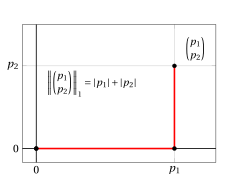{ .fig .ovale loading=lazy style="width:67%" }

- In due dimensioni, tutti i punti con norma \(\ell_1\) minore o uguale a 1

    $$
    \{{{{\boldsymbol x}}} \in \mathbb{R}^2 : \|{{{{\boldsymbol x}}}}\|_1 \le 1\}
    $$

    sono i punti che giacciono sul bordo o all'interno di un <strong>rombo</strong> (un quadrato ruotato di 45°) centrato nell'origine.

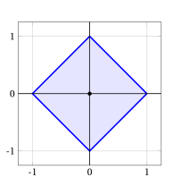{ .fig .ovale loading=lazy style="width:55%" }

### 2.1 Proprietà

- La norma \(\ell_1\) soddisfa le tre proprietà fondamentali che definiscono una norma.

!!! teorema "Osservazione 1: Non negatività e definitezza"

    Per ogni vettore colonna ${\boldsymbol p} \in \mathbb{R}^{n}$, si ha:

    \begin{equation}
    \|{\boldsymbol p}\|_1 \ge 0
    \quad \text{e} \quad 
    \|{\boldsymbol p}\|_1 = 0 \Longleftrightarrow {\boldsymbol p} = {\boldsymbol 0}
    \label{l1_prop1}
    \end{equation}

??? dimostrazione "Dimostrazione"

    Dalla definizione, \(\|{\boldsymbol p}\|_1 = \sum_{j=1}^n |p_j|\).

    1. <strong>Non negatività</strong>: poiché \(|p_j| \ge 0\) per ogni \(j \in \{1,2,\ldots,n\}\) e la somma di numeri non negativi è non negativa, si ha

        $$
        \|{\boldsymbol p}\|_1 = \sum_{j=1}^n |p_j| \ge 0
        \quad \text{per ogni } {\boldsymbol p} \in \mathbb{R}^n.
        $$

    2. <strong>Definitezza</strong>:

        - **(\(\Rightarrow\))** Se \(\|{\boldsymbol p}\|_1 = 0\), allora \(\sum_{j=1}^n |p_j| = 0\). Poiché ogni \(|p_j| \ge 0\), la somma è nulla solo se \(|p_j| = 0\) per ogni \(j \in \{1,2,\ldots,n\}\), quindi \(p_j = 0\) per ogni \(j \in \{1,2,\ldots,n\} \), cioè \({\boldsymbol p} = {\boldsymbol 0}\).

        - **(\(\Leftarrow\))** Se \({\boldsymbol p} = {\boldsymbol 0}\), allora \(p_j = 0\) per ogni \(j \in \{1,2,\ldots,n\}\), quindi

            $$
            \|{\boldsymbol p}\|_1 = \sum_{j=1}^n |0| = 0.
            $$

    
□

!!! teorema "Osservazione 2: Omogeneità assoluta"

    Per ogni scalare $\lambda \in \R$ e ogni vettore colonna ${\boldsymbol p} \in \mathbb{R}^{n}$, si ha:

    \begin{equation}
    \|\lambda \; {\boldsymbol p}\|_1 = |\lambda| \;\| {\boldsymbol p}\|_1
    \label{l1_prop2}
    \end{equation}

??? dimostrazione "Dimostrazione"

    Per ogni scalare \(\lambda \in \R\) e ogni vettore colonna \({\boldsymbol p} \in \mathbb{R}^{n}\), si ha:

    \begin{align*}
    \|\lambda \; {\boldsymbol p}\|_1 &= \sum_{j=1}^n |\lambda \; p_j| \\[1ex]
    &= \sum_{j=1}^n |\lambda| \; |p_j| \quad \text{(proprietà del valore assoluto)} \\[1ex]
    &= |\lambda| \sum_{j=1}^n |p_j| \\[1ex]
    &= |\lambda| \;\| {\boldsymbol p}\|_1
    \end{align*}

    
□

!!! teorema "Osservazione 3: Disuguaglianza triangolare"

    Per ogni coppia di vettori colonna ${\boldsymbol p},{\boldsymbol w} \in \mathbb{R}^{n}$, si ha:

    \begin{equation}
    \|{\boldsymbol p} + {\boldsymbol w}\|_1 \le \|{\boldsymbol p}\|_1 + \|{\boldsymbol w}\|_1
    \label{l1_prop3}
    \end{equation}

??? dimostrazione "Dimostrazione"

    Per ogni coppia di vettori \({\boldsymbol p}, {\boldsymbol w} \in \mathbb{R}^n\), si ha:

    \begin{align*}
    \|{\boldsymbol p} + {\boldsymbol w}\|_1 
    &= \sum_{j=1}^n |p_j + w_j| \\[2ex]
    &\le \sum_{j=1}^n (|p_j| + |w_j|) \quad \text{(disuguaglianza triangolare per il valore assoluto)} \\[2ex]
    &= \sum_{j=1}^n |p_j| + \sum_{j=1}^n |w_j| \\[2ex]
    &= \|{\boldsymbol p}\|_1 + \|{\boldsymbol w}\|_1
    \end{align*}

    
□

## 3. Norma $\ell_2$

!!! definizione "Definizione 2: norma $\ell_2$"

    La <strong>norma \(\ell_2\)</strong> (detta anche <strong>norma euclidea</strong>) di un vettore colonna

    $$
    \underbrace{ 
    \begin{pmatrix}
    p_1 \\
    p_2 \\
    \vdots \\
    p_n
    \end{pmatrix}}_{ {\boldsymbol p}} \in \mathbb{R}^{n}
    $$

    è il numero non negativo definito come:

    \begin{equation}
    \|{\boldsymbol p}\|_2 = \underbrace{\sqrt{\sum_{j=1}^n p_j^2}}_{\sqrt{{\boldsymbol p}' \; {\boldsymbol p}} }
    \label{eucl_norm}
    \end{equation}

- Quando il pedice è omesso, cioè quando scriviamo \(\|{\boldsymbol p}\|\) invece di \(\|{\boldsymbol p}\|_2\), si sottintende la norma \(\ell_2\).

!!! esempio "Esempio 2:  <strong>norma \(\ell_2\)</strong> "

    - Consideriamo i due vettori:

        $$
        \begin{pmatrix} 1 \\ 4 \end{pmatrix} \in \mathbb{R}^{2} 
        \qquad \text{e} \qquad
        \begin{pmatrix} 4 \\ 1 \end{pmatrix} \in \mathbb{R}^{2},
        $$

        Le loro norme sono:

        $$
        \left\| \begin{pmatrix} 1 \\ 4 \end{pmatrix} \right\|_2 = \sqrt{1^2 + 4^2} = \sqrt{1 + 16} = \sqrt{17}, 
        \qquad
        \left\| \begin{pmatrix} 4 \\ 1 \end{pmatrix} \right\|_2 = \sqrt{4^2 + 1^2} = \sqrt{16 + 1} = \sqrt{17}
        $$

    - Consideriamo i quattro vertici del rombo che costituisce la palla unitaria \(\ell_1\) in \( \mathbb{R}^2 \):

        $$
        \begin{pmatrix} 1 \\ 0 \end{pmatrix}, \quad
        \begin{pmatrix} 0 \\ 1 \end{pmatrix}, \quad
        \begin{pmatrix} -1 \\ 0 \end{pmatrix}, \quad
        \begin{pmatrix} 0 \\ -1 \end{pmatrix}
        $$

        Le loro norme sono:

        $$
        \left\| \begin{pmatrix} 1 \\ 0 \end{pmatrix} \right\|_2 = \sqrt{1^2 + 0^2} = 1, ~
        \left\| \begin{pmatrix} 0 \\ 1 \end{pmatrix} \right\|_2 = \sqrt{0^2 + 1^2} = 1, ~
        \left\| \begin{pmatrix} -1 \\ 0 \end{pmatrix} \right\|_2 = \sqrt{(-1)^2 + 0^2} = 1, ~
        \left\| \begin{pmatrix} 0 \\ -1 \end{pmatrix} \right\|_2 = \sqrt{0^2 + (-1)^2} = 1
        $$

- La <strong>norma \(\ell_2\)</strong> di un vettore colonna in \( \mathbb{R}^{n} \) rappresenta la sua <strong>distanza euclidea dall'origine</strong>. Questa interpretazione discende dal <strong>teorema di Pitagora</strong>, come illustrato in \( \mathbb{R}^2 \) nella figura seguente:

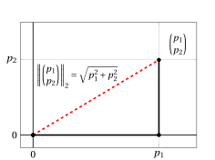{ .fig .ovale loading=lazy style="width:67%" }

- In due dimensioni, tutti i punti con norma \(\ell_2\) minore o uguale a 1

    $$
    \{{{{\boldsymbol x}}} \in \mathbb{R}^2 : \|{{{{\boldsymbol x}}}}\|_2 \le 1\}
    $$

    sono i punti che giacciono sulla o all'interno della <strong>circonferenza unitaria</strong> centrata nell'origine.

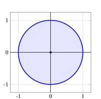{ .fig .ovale loading=lazy style="width:55%" }

!!! chiave ""

    Dati due vettori colonna

    $$
    \underbrace{\begin{pmatrix}
    p_1 \\
    p_2 \\
    \vdots \\
    p_n
    \end{pmatrix}}_{ {\boldsymbol p}} \in \mathbb{R}^{n} 
    \qquad \text{e} \qquad 
    \underbrace{ \begin{pmatrix}
    w_1 \\
    w_2 \\
    \vdots \\
    w_n
    \end{pmatrix}}_{ {\boldsymbol w}} \in \mathbb{R}^{n}
    $$

    la norma della <strong>differenza</strong> dei due vettori è:

    $$
    \|{\boldsymbol p} - {\boldsymbol w}\|_2 = \sqrt{\sum_{j=1}^n \left(p_j - w_j\right)^2}
    $$

    Questa quantità corrisponde sia alla <strong>distanza euclidea</strong> tra i due punti \( {\boldsymbol p} \) e \( {\boldsymbol w} \), sia alla <strong>lunghezza della diagonale</strong> del parallelogramma generato da tali punti, che parte da uno e punta verso l'altro.

!!! esempio "Esempio 3: <strong>norma \(\ell_2\)</strong> della differenza di vettori"

    Consideriamo i due vettori:

    $$
    \begin{pmatrix} 1 \\ 4 \end{pmatrix} \in \mathbb{R}^{2} 
    \qquad \text{e} \qquad
    \begin{pmatrix} 4 \\ 1 \end{pmatrix} \in \mathbb{R}^{2},
    $$

    La norma della differenza dei due vettori è

    $$
    \left\| \begin{pmatrix} 1 \\ 4 \end{pmatrix} - \begin{pmatrix} 4 \\ 1 \end{pmatrix} \right\|_2 
    = \sqrt{(1 - 4)^2 + (4 - 1)^2}
    = \sqrt{(-3)^2 + 3^2}
    = \sqrt{9 + 9}
    = \sqrt{18}
    = 3\sqrt{2}
    $$

    Graficamente, si ha:

    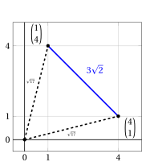{ .fig .ovale loading=lazy style="width:48%" }

!!! chiave ""

    Dati due vettori colonna

    $$
    \underbrace{\begin{pmatrix}
    p_1 \\
    p_2 \\
    \vdots \\
    p_n
    \end{pmatrix}}_{ {\boldsymbol p}} \in \mathbb{R}^{n}
    \quad \text{e} \quad 
    \underbrace{\begin{pmatrix}
    w_1 \\
    w_2 \\
    \vdots \\
    w_n
    \end{pmatrix}}_{ {\boldsymbol w}} \in \mathbb{R}^{n},
    $$

    la norma della <strong>somma</strong> dei due vettori è:

    $$
    \|{\boldsymbol p} + {\boldsymbol w}\|_2 = \sqrt{\sum_{j=1}^n \left(p_j + w_j\right)^2}
    $$

    Questa quantità rappresenta la <strong>lunghezza della diagonale</strong> del parallelogramma generato dai vettori \( {\boldsymbol p} \) e \( {\boldsymbol w} \), entrambi applicati nell'origine.

!!! esempio "Esempio 4: <strong>norma \(\ell_2\)</strong> della somma di vettori"

    Consideriamo i due vettori:

    $$
    \begin{pmatrix} 1 \\ 4 \end{pmatrix} \in \mathbb{R}^{2} 
    \qquad \text{e} \qquad
    \begin{pmatrix} 4 \\ 1 \end{pmatrix} \in \mathbb{R}^{2},
    $$

    La norma della somma dei due vettori è:

    $$
    \left\| \begin{pmatrix} 1 \\ 4 \end{pmatrix} + \begin{pmatrix} 4 \\ 1 \end{pmatrix} \right\|_2
    = \sqrt{5^2 + 5^2}
    = 5\sqrt{2}
    $$

    Graficamente, si ha:

    { .fig .ovale loading=lazy style="width:48%" }

### 3.1 Disuguaglianza di Cauchy–Schwarz

!!! teorema "Osservazione 4: Disuguaglianza di Cauchy–Schwarz"

    Per ogni coppia di vettori colonna ${\boldsymbol p},{\boldsymbol w} \in \mathbb{R}^{n}$, si ha:

    \begin{equation}
    |{\boldsymbol p}' \; {\boldsymbol w}| \le \|{\boldsymbol p}\|_2 \; \|{\boldsymbol w}\|_2
    \label{norm_2}
    \end{equation}

??? dimostrazione "Dimostrazione"

    Se \( {\boldsymbol p} = {\boldsymbol 0} \) oppure \( {\boldsymbol w} = {\boldsymbol 0} \) (o entrambi), la disuguaglianza è ovviamente verificata.

    Supponiamo \( {\boldsymbol p} \neq {\boldsymbol 0} \) e \( {\boldsymbol w} \neq {\boldsymbol 0} \). Consideriamo il vettore:

    $$
    {\boldsymbol u} = \alpha \; {\boldsymbol p} + \beta \; {\boldsymbol w}, \qquad \text{con } \alpha, \beta \in \mathbb{R}
    $$

    Allora, per ogni \( \alpha, \beta \in \mathbb{R} \), si ha:

    \begin{align*}
    \underbrace{{\boldsymbol u}' \; {\boldsymbol u}}_{\ge 0}
    &= (\alpha \; {\boldsymbol p} + \beta \; {\boldsymbol w})' \; (\alpha \; {\boldsymbol p} + \beta \; {\boldsymbol w}) \\[1ex]
    &= \alpha^2 \; {\boldsymbol p}' \; {\boldsymbol p} 
    + 2\alpha\beta \; {\boldsymbol p}' \; {\boldsymbol w} 
    + \beta^2 \; {\boldsymbol w}' \; {\boldsymbol w} \ge 0
    \end{align*}

    Scegliamo ora:

    $$
    \alpha = {\boldsymbol w}' \; {\boldsymbol w}, \qquad 
    \beta = -{\boldsymbol p}' \; {\boldsymbol w}
    $$

    Sostituendo, otteniamo:

    \begin{align*}
    &({\boldsymbol w}' \; {\boldsymbol w})^2 \; {\boldsymbol p}' \; {\boldsymbol p}
    - 2 \; ({\boldsymbol p}' \; {\boldsymbol w})^2 \; ({\boldsymbol w}' \; {\boldsymbol w})
    + ({\boldsymbol p}' \; {\boldsymbol w})^2 \; ({\boldsymbol w}' \; {\boldsymbol w}) \\[1ex]
    &= {\boldsymbol w}' \; {\boldsymbol w} \; 
    \left( ({\boldsymbol w}' \; {\boldsymbol w}) \; {\boldsymbol p}' \; {\boldsymbol p} 
    - ({\boldsymbol p}' \; {\boldsymbol w})^2 \right) \ge 0
    \end{align*}

    Poiché \( {\boldsymbol w}' \; {\boldsymbol w} = \|{\boldsymbol w}\|_2^2 > 0 \), dividendo entrambi i membri si ottiene:

    $$
    ({\boldsymbol p}' \; {\boldsymbol w})^2 \le {\boldsymbol p}' \; {\boldsymbol p} \; {\boldsymbol w}' \; {\boldsymbol w}
    \quad \Longrightarrow \quad
    |{\boldsymbol p}' \; {\boldsymbol w}| \le \sqrt{{\boldsymbol p}' \; {\boldsymbol p} \; {\boldsymbol w}' \; {\boldsymbol w}} 
    = \sqrt{{\boldsymbol p}' \; {\boldsymbol p}} \; \sqrt{{\boldsymbol w}' \; {\boldsymbol w}} 
    = \|{\boldsymbol p}\|_2 \; \|{\boldsymbol w}\|_2
    $$

    
□

### 3.2 Proprietà

- La norma \(\ell_2\) soddisfa le tre proprietà fondamentali che definiscono una norma.

!!! teorema "Osservazione 5: Non negatività e definitezza"

    Per ogni vettore colonna ${\boldsymbol p} \in \mathbb{R}^{n}$, si ha:

    \begin{equation}
    \|{\boldsymbol p}\|_2 \ge 0
    \quad \text{e} \quad 
    \|{\boldsymbol p}\|_2 = 0 \Longleftrightarrow {\boldsymbol p} = 
    {\boldsymbol 0}
    \label{scalar_4}
    \end{equation}

??? dimostrazione "Dimostrazione"

    Dalla definizione, \(\|{\boldsymbol p}\|_2 = \sqrt{{\boldsymbol p}' \, {\boldsymbol p}}\).

    1. <strong>Non negatività</strong>: poiché \({\boldsymbol p}' \, {\boldsymbol p} = \sum_{j=1}^n p_j^2 \ge 0\) (in quanto somma di quadrati) e la funzione radice quadrata assume valori non negativi, si ha \(\|{\boldsymbol p}\|_2 \ge 0\) per ogni \({\boldsymbol p} \in \mathbb{R}^n\).

    2. <strong>Definitezza</strong>:

        - **(\(\Rightarrow\))** Se \(\|{\boldsymbol p}\|_2 = 0\), allora \(\sqrt{{\boldsymbol p}' \, {\boldsymbol p}} = 0\), quindi \({\boldsymbol p}' \, {\boldsymbol p} = 0\), cioè

            $$
            \sum_{j=1}^n p_j^2 = 0.
            $$

            Poiché ogni \(p_j^2 \ge 0\), la somma è nulla solo se \(p_j^2 = 0\) per ogni \(j \in \{1,2,\ldots,n\}\), quindi \(p_j = 0\) per ogni \(j \in \{1,2,\ldots,n\}\), cioè \({\boldsymbol p} = {\boldsymbol 0}\).

        - **(\(\Leftarrow\))** Se \({\boldsymbol p} = {\boldsymbol 0}\), allora \({\boldsymbol p}' \, {\boldsymbol p} = 0\), quindi \(\|{\boldsymbol p}\|_2 = \sqrt{0} = 0\).

    
□

!!! teorema "Osservazione 6: Omogeneità assoluta"

    Per ogni vettore colonna ${\boldsymbol p} \in \mathbb{R}^{n}$ e ogni scalare $\lambda \in \R$, si ha:

    \begin{equation}
    \|\lambda \; {\boldsymbol p}\|_2 = |\lambda| \;\| {\boldsymbol p}\|_2
    \label{norm_1}
    \end{equation}

??? dimostrazione "Dimostrazione"

    Per ogni scalare $\lambda \in \R$ e ogni vettore colonna ${\boldsymbol p} \in \mathbb{R}^{n}$, si ha:

    $$
    \|\lambda \; {\boldsymbol p}\|_2 = \sqrt{\sum_{j=1}^n (\lambda \; p_j)^2} = \sqrt{\sum_{j=1}^n \lambda^2 \; p_j^2}=|\lambda| \; \sqrt{\sum_{j=1}^n \; p_j^2}=|\lambda| \;\| {\boldsymbol p}\|_2
    $$

    
□

!!! teorema "Osservazione 7: Disuguaglianza triangolare"

    Per ogni coppia di vettori colonna ${\boldsymbol p},{\boldsymbol w} \in \mathbb{R}^{n}$, si ha:

    \begin{equation}
    \|{\boldsymbol p} + {\boldsymbol w}\|_2 \le \|{\boldsymbol p}\|_2 + \|{\boldsymbol w}\|_2
    \label{TTTTT}
    \end{equation}

??? dimostrazione "Dimostrazione"

    Per ogni coppia di vettori \( {\boldsymbol p}, {\boldsymbol w} \in \mathbb{R}^n \), si ha:

    \begin{align*}
    \|{\boldsymbol p} + {\boldsymbol w}\|_2^2 
    &= ({\boldsymbol p} + {\boldsymbol w})' \; ({\boldsymbol p} + {\boldsymbol w}) = {\boldsymbol p}' \; {\boldsymbol p} + 2 \; {\boldsymbol p}' \; {\boldsymbol w} + {\boldsymbol w}' \; {\boldsymbol w} = \|{\boldsymbol p}\|_2^2 + \|{\boldsymbol w}\|_2^2 + 2 \; {\boldsymbol p}' \; {\boldsymbol w} \\[1ex]
    &\le \|{\boldsymbol p}\|_2^2 + \|{\boldsymbol w}\|_2^2 + 2 \; \|{\boldsymbol p}\|_2 \; \|{\boldsymbol w}\|_2 
    \qquad \text{(per la disuguaglianza di Cauchy–Schwarz)} \\[1ex]
    &= \left( \|{\boldsymbol p}\|_2 + \|{\boldsymbol w}\|_2 \right)^2
    \end{align*}

    Di conseguenza, otteniamo:

    $$
    \|{\boldsymbol p} + {\boldsymbol w}\|_2^2 
    \le \left( \|{\boldsymbol p}\|_2 + \|{\boldsymbol w}\|_2 \right)^2 
    \quad \Longrightarrow \quad
    \|{\boldsymbol p} + {\boldsymbol w}\|_2 \le \|{\boldsymbol p}\|_2 + \|{\boldsymbol w}\|_2
    $$

    
□

- In $\R^2$, la disuguaglianza triangolare afferma che <strong>in ogni triangolo la somma delle lunghezze di due lati qualsiasi è maggiore o uguale alla lunghezza del lato rimanente</strong>.

!!! esempio "Esempio 5: disuguaglianza triangolare"

    Consideriamo i due vettori $\begin{pmatrix} 1 \\ 4 \end{pmatrix}  \in \R^2$ e $\begin{pmatrix} 4 \\ 1 \end{pmatrix}  \in \R^2$; si ha:

    $$
    \left\| \begin{pmatrix} 1 \\ 4 \end{pmatrix} \right\|_2 = \sqrt{1^2 + 4^2} = \sqrt{1 + 16} = \sqrt{17}
    $$

    $$
    \left\| \begin{pmatrix} 4 \\ 1 \end{pmatrix} \right\|_2 = \sqrt{4^2 + 1^2} = \sqrt{16 + 1} = \sqrt{17}
    $$

    \begin{align*}
    \left\| \begin{pmatrix} 1 \\ 4 \end{pmatrix} + \begin{pmatrix} 4 \\ 1 \end{pmatrix} \right\|_2 = \sqrt{(1 + 4)^2 + (4 + 1)^2} = \sqrt{5^2 + 5^2}= 5\sqrt{2}
    \end{align*}

    $$
    5\sqrt{2} \le \sqrt{17} + \sqrt{17}
    $$

    { .fig .ovale loading=lazy style="width:48%" }

- Un'altra forma della disuguaglianza triangolare è:

    \begin{equation}
    \|{\boldsymbol r}\|_2 \le \|{\boldsymbol r}-{\boldsymbol s}\|_2 + \|{\boldsymbol s}\|_2 {\rm ~~~~~cioè~~~~~} \|{\boldsymbol r}\|_2 - \|{\boldsymbol s}\|_2 \le \|{\boldsymbol r}-{\boldsymbol s}\|_2 , \quad \forall  {\boldsymbol r},{\boldsymbol s} \in \mathbb{R}^n
     \label{CCCC}
    \end{equation}

    Per ottenerla, basta porre in \(\eqref{TTTTT}\):

    $$
    {\boldsymbol p} =  {\boldsymbol r} - {\boldsymbol s}, \quad  {\boldsymbol w} = {\boldsymbol s}
    $$

!!! teorema "Osservazione 8: disuguaglianza triangolare inversa"

    Per ogni coppia di vettori colonna ${\boldsymbol p},{\boldsymbol w} \in \mathbb{R}^{n}$, si ha:

    \begin{equation}
    | \|{\boldsymbol p}\|_2 - \|{\boldsymbol w}\|_2  |  \le \|{\boldsymbol p} - {\boldsymbol w}\|_2
    \label{KKKKK}
    \end{equation}

??? dimostrazione "Dimostrazione"

    Per ogni coppia di vettori \( {\boldsymbol p}, {\boldsymbol w} \in \mathbb{R}^n \), si ha:

    \begin{align*}
    \|{\boldsymbol p} - {\boldsymbol w}\|_2^2 
    &= ({\boldsymbol p} - {\boldsymbol w})' \; ({\boldsymbol p} - {\boldsymbol w}) = {\boldsymbol p}' \; {\boldsymbol p} - 2 \; {\boldsymbol p}' \; {\boldsymbol w} + {\boldsymbol w}' \; {\boldsymbol w} = \|{\boldsymbol p}\|_2^2 + \|{\boldsymbol w}\|_2^2 - 2 \; {\boldsymbol p}' \; {\boldsymbol w} \\[1ex]
    &\ge \|{\boldsymbol p}\|_2^2 + \|{\boldsymbol w}\|_2^2 - 2 \; \|{\boldsymbol p}\|_2 \; \|{\boldsymbol w}\|_2 
    \qquad \text{(per la disuguaglianza di Cauchy–Schwarz)} \\[1ex]
    &= \left( \|{\boldsymbol p}\|_2 - \|{\boldsymbol w}\|_2 \right)^2
    \end{align*}

    Di conseguenza, otteniamo:

    $$
    \left( \|{\boldsymbol p}\|_2 - \|{\boldsymbol w}\|_2 \right)^2 
    \le \|{\boldsymbol p} - {\boldsymbol w}\|_2^2 
    \quad \Longrightarrow \quad
    | \|{\boldsymbol p}\|_2 - \|{\boldsymbol w}\|_2 | \le \|{\boldsymbol p} - {\boldsymbol w}\|_2
    $$

    
□

- In $\R^2$, la disuguaglianza triangolare inversa afferma che <strong>in ogni triangolo la lunghezza di ciascun lato è maggiore o uguale alla differenza tra le lunghezze degli altri due lati</strong>.

!!! esempio "Esempio 6: disuguaglianza triangolare inversa"

    Consideriamo i due vettori $\begin{pmatrix} 1 \\ 4 \end{pmatrix}  \in \R^2$ e $\begin{pmatrix} 4 \\ 1 \end{pmatrix}  \in \R^2$; si ha:

    $$
    \left\| \begin{pmatrix} 1 \\ 4 \end{pmatrix} \right\|_2 = \sqrt{1^2 + 4^2} = \sqrt{1 + 16} = \sqrt{17}
    $$

    $$
    \left\| \begin{pmatrix} 4 \\ 1 \end{pmatrix} \right\|_2 = \sqrt{4^2 + 1^2} = \sqrt{16 + 1} = \sqrt{17}
    $$

    \begin{align*}
    \left\| \begin{pmatrix} 1 \\ 4 \end{pmatrix} - \begin{pmatrix} 4 \\ 1 \end{pmatrix} \right\|_2  = \sqrt{(1 - 4)^2 + (4 - 1)^2}= 3\sqrt{2}
    \end{align*}

    $$
    \left| \sqrt{17} - \sqrt{17} \right|  \le 3\sqrt{2}
    $$

    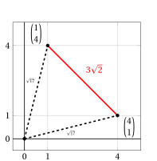{ .fig .ovale loading=lazy style="width:48%" }

## 4. Norma $\ell_2$ generalizzata

!!! definizione "Definizione 3: norma $\ell_2$ generalizzata"

    Data una matrice simmetrica definita positiva

    $$
    \underbrace{
    \begin{pmatrix}
    q_{11} & q_{12} & \ldots & q_{1n} \\[0.5ex]
    q_{21} & q_{22} & \ldots & q_{2n} \\[0.5ex]
    \vdots & \vdots & \ddots & \vdots \\[0.5ex]
    q_{n1} & q_{n2} & \ldots & q_{nn}
    \end{pmatrix}}_{\,\boldsymbol{Q}} \in \mathbb{R}^{n \times n}
    $$

    la <strong>norma \(\ell_2\) generalizzata</strong> di un vettore colonna

    $$
    \underbrace{
    \begin{pmatrix}
    p_1 \\
    p_2 \\
    \vdots \\
    p_n
    \end{pmatrix}}_{\,\boldsymbol{p}} \in \mathbb{R}^{n}
    $$

    è il numero non negativo definito come:

    \begin{equation}
    \| \boldsymbol{p} \|_{\boldsymbol{Q}} 
    = \underbrace{\sqrt{\sum_{i=1}^n \sum_{j=1}^n q_{ij} \, p_i \, p_j}}_{\,\sqrt{\boldsymbol{p}' \boldsymbol{Q} \boldsymbol{p}}}
    \label{extend_norm}
    \end{equation}

- La <strong>norma \(\ell_2\) generalizzata</strong> estende la norma euclidea standard introducendo una matrice definita positiva \(\boldsymbol{Q}\), che pesa ed eventualmente correla le componenti del vettore.

- Quando \(\boldsymbol{Q}\) è la matrice identità \(\boldsymbol{I}\), la norma \(\ell_2\) generalizzata si riduce alla norma \(\ell_2\) standard.

- La matrice \(\boldsymbol{Q}\) deve essere <strong>definita positiva</strong> per garantire che \(\boldsymbol{p}' \boldsymbol{Q} \boldsymbol{p} \ge 0\) per ogni \(\boldsymbol{p} \in \mathbb{R}^n\), così che la radice quadrata sia ben definita, e che \(\boldsymbol{p}' \boldsymbol{Q} \boldsymbol{p} = 0\) solo per \(\boldsymbol{p} = \boldsymbol{0}\).

- In due dimensioni, tutti i punti con norma \(\ell_2\) generalizzata minore o uguale a 1

    $$
    \{{{{\boldsymbol x}}} \in \mathbb{R}^2 : \|{{{{\boldsymbol x}}}}\|_{\boldsymbol{Q}} \le 1\}
    $$

    sono i punti che giacciono sul bordo o all'interno di un'<strong>ellisse</strong> centrata nell'origine, la cui dimensione, forma e rotazione sono determinate dalla matrice \(\boldsymbol{Q}\). In particolare, gli autovettori di \(\boldsymbol{Q}\) determinano gli assi principali e l'orientazione, mentre gli autovalori determinano le lunghezze dei semiassi.

!!! esempio "Esempio 7: <strong>norma \(\ell_2\) generalizzata</strong>"

    In $\mathbb{R}^2$, consideriamo la seguente matrice diagonale definita positiva

    $$
    {\boldsymbol Q} =
    \begin{pmatrix}
    4 & 0 \\[1ex]
    0 & 1
    \end{pmatrix}
    $$

    Poiché \(\boldsymbol{Q}\) è <strong>diagonale</strong>, gli autovalori sono gli elementi diagonali:

    $$
    \lambda_1 = 4, \qquad \lambda_2 = 1
    $$

    e gli autovettori sono i vettori della base canonica:

    $$
    \boldsymbol{v}_1 = \begin{pmatrix} 1 \\[0.5ex] 0 \end{pmatrix}
    \quad \text{(per } \lambda_1 = 4\text{)},
    \qquad
    \boldsymbol{v}_2 = \begin{pmatrix} 0 \\[0.5ex] 1 \end{pmatrix}
    \quad \text{(per } \lambda_2 = 1\text{)}
    $$

    <strong>Lunghezze dei semiassi e orientazione:</strong>

    - Le lunghezze dei semiassi sono \(\frac{1}{\sqrt{\lambda_1}} = \frac{1}{\sqrt{4}} = \frac{1}{2}\) e \(\frac{1}{\sqrt{\lambda_2}} = \frac{1}{\sqrt{1}} = 1\).

    - Poiché gli autovettori sono allineati con gli assi coordinati, l'ellisse <strong>non è ruotata</strong>.

    - Gli assi principali coincidono con gli assi \(x_1\) e \(x_2\).

    L'insieme dei punti con norma \(\ell_2\) generalizzata \(\le 1\) è:

    $$
    \{{{{\boldsymbol x}}} \in \mathbb{R}^2 : \|{{{{\boldsymbol x}}}}\|_{\boldsymbol{Q}} \le 1\}
    =
    \left\{
    \begin{pmatrix}
    x_1 \\[0.3ex]
    x_2
    \end{pmatrix}
    \in \mathbb{R}^2 :
    \sqrt{4 x_1^2 + x_2^2} \le 1
    \right\}
    =
    \left\{
    \begin{pmatrix}
    x_1 \\[0.3ex]
    x_2
    \end{pmatrix}
    \in \mathbb{R}^2 :
    \frac{x_1^2}{(1/2)^2} + \frac{x_2^2}{1^2} \le 1
    \right\}
    $$

    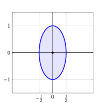{ .fig .ovale loading=lazy style="width:48%" }

!!! esempio "Esempio 8: <strong>norma \(\ell_2\) generalizzata</strong>"

    In $\mathbb{R}^2$, consideriamo la seguente matrice diagonale definita positiva

    $$
    {\boldsymbol Q} =
    \begin{pmatrix}
    \frac{1}{9} & 0 \\[1ex]
    0 & \frac{1}{4}
    \end{pmatrix}
    $$

    Poiché \(\boldsymbol{Q}\) è <strong>diagonale</strong>, gli autovalori sono gli elementi diagonali:

    $$
    \lambda_1 = \frac{1}{9}, \qquad \lambda_2 = \frac{1}{4}
    $$

    e gli autovettori sono i vettori della base canonica:

    $$
    \boldsymbol{v}_1 = \begin{pmatrix} 1 \\[0.5ex] 0 \end{pmatrix}
    \quad \text{(per } \lambda_1 = \frac{1}{9}\text{)},
    \qquad
    \boldsymbol{v}_2 = \begin{pmatrix} 0 \\[0.5ex] 1 \end{pmatrix}
    \quad \text{(per } \lambda_2 = \frac{1}{4}\text{)}
    $$

    <strong>Lunghezze dei semiassi e orientazione:</strong>

    - Le lunghezze dei semiassi sono \(\frac{1}{\sqrt{\lambda_1}} = \frac{1}{\sqrt{1/9}} = 3\) e \(\frac{1}{\sqrt{\lambda_2}} = \frac{1}{\sqrt{1/4}} = 2\).

    - Poiché gli autovettori sono allineati con gli assi coordinati, l'ellisse <strong>non è ruotata</strong>.

    - Gli assi principali coincidono con gli assi \(x_1\) e \(x_2\).

    L'insieme dei punti con norma \(\ell_2\) generalizzata \(\le 1\) è:

    $$
    \{{{{\boldsymbol x}}} \in \mathbb{R}^2 : \|{{{{\boldsymbol x}}}}\|_{\boldsymbol{Q}} \le 1\}
    =
    \left\{
    \begin{pmatrix}
    x_1 \\[0.3ex]
    x_2
    \end{pmatrix}
    \in \mathbb{R}^2 :
    \sqrt{\frac{x_1^2}{9} + \frac{x_2^2}{4}} \le 1
    \right\}
    =
    \left\{
    \begin{pmatrix}
    x_1 \\[0.3ex]
    x_2
    \end{pmatrix}
    \in \mathbb{R}^2 :
    \frac{x_1^2}{3^2} + \frac{x_2^2}{2^2} \le 1
    \right\}
    $$

    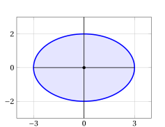{ .fig .ovale loading=lazy style="width:55%" }

!!! esempio "Esempio 9: <strong>norma \(\ell_2\) generalizzata</strong>"

    In $\mathbb{R}^2$, consideriamo la seguente matrice simmetrica definita positiva

    $$
    {\boldsymbol Q} =
    \begin{pmatrix}
    2 & -1 \\[1ex]
    -1 & 2
    \end{pmatrix}
    $$

    Gli autovalori di \(\boldsymbol{Q}\) si trovano risolvendo l'equazione caratteristica:

    $$
    \det(\boldsymbol{Q} - \lambda \boldsymbol{I}) = \det\begin{pmatrix}
    2-\lambda & -1 \\[0.5ex]
    -1 & 2-\lambda
    \end{pmatrix}
    = (2-\lambda)^2 - 1 = \lambda^2 - 4\lambda + 3 = 0
    $$

    da cui:

    $$
    \lambda_1 = 1, \qquad \lambda_2 = 3
    $$

    Gli autovettori corrispondenti sono:

    $$
    \boldsymbol{v}_1 = \begin{pmatrix} 1 \\[0.5ex] 1 \end{pmatrix}
    \quad \text{(per } \lambda_1 = 1\text{)},
    \qquad
    \boldsymbol{v}_2 = \begin{pmatrix} 1 \\[0.5ex] -1 \end{pmatrix}
    \quad \text{(per } \lambda_2 = 3\text{)}
    $$

    <strong>Lunghezze dei semiassi e orientazione:</strong>

    - Le lunghezze dei semiassi sono \(\frac{1}{\sqrt{\lambda_1}} = \frac{1}{\sqrt{1}} = 1\) e \(\frac{1}{\sqrt{\lambda_2}} = \frac{1}{\sqrt{3}}\).

    - Poiché gli autovettori <strong>non sono allineati</strong> con gli assi coordinati, l'ellisse è <strong>ruotata</strong>.

    - Gli assi principali coincidono con le direzioni degli autovettori.

    L'insieme dei punti con norma \(\ell_2\) generalizzata \(\le 1\) è:

    $$
    \{{{{\boldsymbol x}}} \in \mathbb{R}^2 : \|{{{{\boldsymbol x}}}}\|_{\boldsymbol{Q}} \le 1\}
    =
    \left\{
    \begin{pmatrix}
    x_1 \\[0.3ex]
    x_2
    \end{pmatrix}
    \in \mathbb{R}^2 :
    \sqrt{2x_1^2 - 2x_1x_2 + 2x_2^2} \le 1
    \right\}
    =
    \left\{
    \begin{pmatrix}
    x_1 \\[0.3ex]
    x_2
    \end{pmatrix}
    \in \mathbb{R}^2 :
    2x_1^2 - 2x_1x_2 + 2x_2^2 \le 1
    \right\}
    $$

    { .fig .ovale loading=lazy style="width:53%" }

### 4.1 Disuguaglianza di Cauchy–Schwarz generalizzata

!!! teorema "Osservazione 9: disuguaglianza di Cauchy–Schwarz generalizzata"

    Per ogni matrice simmetrica definita positiva $\boldsymbol{Q} \in \mathbb{R}^{n \times n}$ e ogni coppia di vettori colonna ${\boldsymbol p},{\boldsymbol w} \in \mathbb{R}^{n}$, si ha:

    \begin{equation}
    |{\boldsymbol p}' \; {\boldsymbol Q} \; {\boldsymbol w}| 
    \le \|{\boldsymbol p}\|_{\boldsymbol Q} \; \|{\boldsymbol w}\|_{\boldsymbol Q}
    \label{norm_10000}
    \end{equation}

??? dimostrazione "Dimostrazione"

    Se \( {\boldsymbol p} = {\boldsymbol 0} \) oppure \( {\boldsymbol w} = {\boldsymbol 0} \) (o entrambi), la disuguaglianza è ovviamente verificata.

    Supponiamo \( {\boldsymbol p} \neq {\boldsymbol 0} \) e \( {\boldsymbol w} \neq {\boldsymbol 0} \). Consideriamo il vettore:

    $$
    {\boldsymbol u} = \alpha \; {\boldsymbol p} + \beta \; {\boldsymbol w}, \qquad \text{con } \alpha, \beta \in \mathbb{R}
    $$

    Allora, per ogni \( \alpha, \beta \in \mathbb{R} \), si ha:

    \begin{align*}
    \underbrace{{\boldsymbol u}' \; {\boldsymbol Q} \; {\boldsymbol u}}_{\ge 0}
    &= (\alpha \; {\boldsymbol p} + \beta \; {\boldsymbol w})' \; {\boldsymbol Q} \; (\alpha \; {\boldsymbol p} + \beta \; {\boldsymbol w}) \\[1ex]
    &= \alpha^2 \; {\boldsymbol p}' \; {\boldsymbol Q} \; {\boldsymbol p} 
    + 2\alpha\beta \; {\boldsymbol p}' \; {\boldsymbol Q} \; {\boldsymbol w} 
    + \beta^2 \; {\boldsymbol w}' \; {\boldsymbol Q} \; {\boldsymbol w} \ge 0
    \end{align*}

    dove abbiamo usato \({\boldsymbol w}' \; {\boldsymbol Q} \; {\boldsymbol p} = {\boldsymbol p}' \; {\boldsymbol Q} \; {\boldsymbol w}\), che vale perché \({\boldsymbol Q}\) è simmetrica.

    Scegliamo ora:

    $$
    \alpha = {\boldsymbol w}' \; {\boldsymbol Q} \; {\boldsymbol w}, \qquad 
    \beta = -{\boldsymbol p}' \; {\boldsymbol Q} \; {\boldsymbol w}
    $$

    Sostituendo, otteniamo:

    \begin{align*}
    &({\boldsymbol w}' \; {\boldsymbol Q} \; {\boldsymbol w})^2 \; {\boldsymbol p}' \; {\boldsymbol Q} \; {\boldsymbol p}
    - 2 \; ({\boldsymbol p}' \; {\boldsymbol Q} \; {\boldsymbol w})^2 \; ({\boldsymbol w}' \; {\boldsymbol Q} \; {\boldsymbol w})
    + ({\boldsymbol p}' \; {\boldsymbol Q} \; {\boldsymbol w})^2 \; ({\boldsymbol w}' \; {\boldsymbol Q} \; {\boldsymbol w}) \\[1ex]
    &= {\boldsymbol w}' \; {\boldsymbol Q} \; {\boldsymbol w} \; 
    \left( ({\boldsymbol w}' \; {\boldsymbol Q} \; {\boldsymbol w}) \; {\boldsymbol p}' \; {\boldsymbol Q} \; {\boldsymbol p} 
    - ({\boldsymbol p}' \; {\boldsymbol Q} \; {\boldsymbol w})^2 \right) \ge 0
    \end{align*}

    Poiché \( {\boldsymbol w}' \; {\boldsymbol Q} \; {\boldsymbol w} = \|{\boldsymbol w}\|_{\boldsymbol Q}^2 > 0 \), dividendo entrambi i membri si ottiene:

    $$
    ({\boldsymbol p}' \; {\boldsymbol Q} \; {\boldsymbol w})^2 \le {\boldsymbol p}' \; {\boldsymbol Q} \; {\boldsymbol p} \cdot {\boldsymbol w}' \; {\boldsymbol Q} \; {\boldsymbol w}
    \quad \Longrightarrow \quad
    |{\boldsymbol p}' \; {\boldsymbol Q} \; {\boldsymbol w}| \le \sqrt{{\boldsymbol p}' \; {\boldsymbol Q} \; {\boldsymbol p}} \; \sqrt{{\boldsymbol w}' \; {\boldsymbol Q} \; {\boldsymbol w}} 
    = \|{\boldsymbol p}\|_{\boldsymbol Q} \; \|{\boldsymbol w}\|_{\boldsymbol Q}
    $$

    
□

### 4.2 Proprietà

- La norma \(\ell_2\) generalizzata soddisfa le tre proprietà fondamentali che definiscono una norma.

!!! teorema "Osservazione 10: Non negatività e definitezza"

    Per ogni matrice definita positiva $\boldsymbol{Q} \in \mathbb{R}^{n \times n}$ e ogni vettore colonna ${\boldsymbol p} \in \mathbb{R}^{n}$, si ha:

    \begin{equation}
    \|{\boldsymbol p}\|_{\boldsymbol Q} \ge 0
    \quad \text{e} \quad 
    \|{\boldsymbol p}\|_{\boldsymbol Q}= 0 \Longleftrightarrow {\boldsymbol p} = 
    {\boldsymbol 0}
    \label{scalar_6}
    \end{equation}

??? dimostrazione "Dimostrazione"

    Per definizione, \(\|{\boldsymbol p}\|_{\boldsymbol Q} = \sqrt{{\boldsymbol p}' \, {\boldsymbol Q} \, {\boldsymbol p}}\). Poiché \({\boldsymbol Q}\) è definita positiva, si ha \({\boldsymbol p}' \, {\boldsymbol Q} \, {\boldsymbol p} > 0\) per ogni \({\boldsymbol p}\neq{\boldsymbol 0}\), e \({\boldsymbol 0}' \, {\boldsymbol Q} \, {\boldsymbol 0}=0\).

    1. <strong>Non negatività</strong>: per ogni \({\boldsymbol p} \in \mathbb{R}^n\), si ha \({\boldsymbol p}' \, {\boldsymbol Q} \, {\boldsymbol p} \ge 0\). Pertanto

        $$
        \|{\boldsymbol p}\|_{\boldsymbol Q} = \sqrt{{\boldsymbol p}' \, {\boldsymbol Q} \, {\boldsymbol p}} \ge 0.
        $$

    2. <strong>Definitezza</strong>:

        - **(\(\Rightarrow\))** Se \(\|{\boldsymbol p}\|_{\boldsymbol Q} = 0\), allora

            $$
            \sqrt{{\boldsymbol p}' \, {\boldsymbol Q} \, {\boldsymbol p}} = 0
            \quad \Longrightarrow \quad
            {\boldsymbol p}' \, {\boldsymbol Q} \, {\boldsymbol p} = 0,
            $$

            il che implica \({\boldsymbol p} = {\boldsymbol 0}\) (poiché \({\boldsymbol Q}\) è definita positiva).

        - **(\(\Leftarrow\))** Se \({\boldsymbol p} = {\boldsymbol 0}\), allora

            $$
            {\boldsymbol p}' \, {\boldsymbol Q} \, {\boldsymbol p}
            = {\boldsymbol 0}' \, {\boldsymbol Q} \, {\boldsymbol 0} = 0,
            $$

            e quindi \(\|{\boldsymbol p}\|_{\boldsymbol Q} = \sqrt{0} = 0\).

    
□

!!! teorema "Osservazione 11: Omogeneità assoluta"

    Per ogni matrice definita positiva $\boldsymbol{Q} \in \mathbb{R}^{n \times n}$, ogni scalare $\lambda \in \mathbb{R}$ e ogni vettore colonna $\boldsymbol{p} \in \mathbb{R}^{n}$, si ha:

    \begin{equation}
    \|\lambda \, \boldsymbol{p}\|_{\boldsymbol{Q}} = |\lambda| \, \|\boldsymbol{p}\|_{\boldsymbol{Q}}
    \label{norm_1000}
    \end{equation}

??? dimostrazione "Dimostrazione"

    Per ogni scalare $\lambda \in \R$ e ogni vettore ${\boldsymbol p} \in \mathbb{R}^{n}$, si ha:

    \begin{align*}
    \|\lambda \; {\boldsymbol p}\|_{\boldsymbol Q} &= \sqrt{\sum_{i=1}^n \sum_{j=1}^n q_{ij} \lambda\; p_i\;\lambda\;p_j }\\[2ex] 
    &= \sqrt{\sum_{i=1}^n \sum_{j=1}^n \lambda^2\; q_{ij}\; p_i\;p_j }\\[2ex] 
    &=|\lambda| \; \sqrt{\sum_{i=1}^n \sum_{j=1}^n q_{ij} \;p_i\;p_j}\\[2ex]
    &=|\lambda| \;\| {\boldsymbol p}\|_{\boldsymbol Q}
    \end{align*}

    
□

!!! teorema "Osservazione 12: Disuguaglianza triangolare"

    Per ogni matrice definita positiva $\boldsymbol{Q} \in \mathbb{R}^{n \times n}$ e ogni coppia di vettori colonna ${\boldsymbol p}, {\boldsymbol w} \in \mathbb{R}^{n}$, si ha:

    \begin{equation}
    \|{\boldsymbol p} + {\boldsymbol w}\|_{\boldsymbol Q} 
    \le \|{\boldsymbol p}\|_{\boldsymbol Q} + \|{\boldsymbol w}\|_{\boldsymbol Q}
    \label{TTTTTTTT}
    \end{equation}

??? dimostrazione "Dimostrazione"

    Per ogni \( {\boldsymbol p}, {\boldsymbol w} \in \mathbb{R}^n \), si ha:

    \begin{align*}
    \|{\boldsymbol p} + {\boldsymbol w}\|_{\boldsymbol Q}^2 
    &= ({\boldsymbol p} + {\boldsymbol w})' \; {\boldsymbol Q} \; ({\boldsymbol p} + {\boldsymbol w}) = {\boldsymbol p}' \; {\boldsymbol Q} \; {\boldsymbol p} + 2 \; {\boldsymbol p}' \; {\boldsymbol Q} \; {\boldsymbol w} + {\boldsymbol w}' \; {\boldsymbol Q} \; {\boldsymbol w} \\[1ex]
    &= \|{\boldsymbol p}\|_{\boldsymbol Q}^2 + \|{\boldsymbol w}\|_{\boldsymbol Q}^2 + 2 \; {\boldsymbol p}' \; {\boldsymbol Q} \; {\boldsymbol w} \\[1ex]
    &\le \|{\boldsymbol p}\|_{\boldsymbol Q}^2 + \|{\boldsymbol w}\|_{\boldsymbol Q}^2 + 2 \; \|{\boldsymbol p}\|_{\boldsymbol Q} \; \|{\boldsymbol w}\|_{\boldsymbol Q} 
    \qquad \text{(Cauchy–Schwarz generalizzata)} \\[1ex]
    &= \left( \|{\boldsymbol p}\|_{\boldsymbol Q} + \|{\boldsymbol w}\|_{\boldsymbol Q} \right)^2
    \end{align*}

    Di conseguenza, otteniamo:

    $$
    \|{\boldsymbol p} + {\boldsymbol w}\|_{\boldsymbol Q}^2 
    \le \left( \|{\boldsymbol p}\|_{\boldsymbol Q} + \|{\boldsymbol w}\|_{\boldsymbol Q} \right)^2 
    \quad \Longrightarrow \quad
    \|{\boldsymbol p} + {\boldsymbol w}\|_{\boldsymbol Q} \le \|{\boldsymbol p}\|_{\boldsymbol Q} + \|{\boldsymbol w}\|_{\boldsymbol Q}
    $$

    
□

## 5. Norma $\ell_\infty$

!!! definizione "Definizione 4: norma $\ell_\infty$"

    La <strong>norma \(\ell_\infty\)</strong> (detta anche <strong>norma del massimo</strong>, <strong>norma del sup</strong> o <strong>norma di Chebyshev</strong>) di un vettore colonna

    $$
    \underbrace{ 
    \begin{pmatrix}
    p_1 \\
    p_2 \\
    \vdots \\
    p_n
    \end{pmatrix}}_{ {\boldsymbol p}} \in \mathbb{R}^{n}
    $$

    è il numero non negativo definito come:

    \begin{equation}
    \|{\boldsymbol p}\|_\infty = \max\big\{~|p_j| : j \in \{1,2,\ldots,n\}~\big\}
    \label{linf_norm}
    \end{equation}

- La <strong>norma \(\ell_\infty\)</strong> rappresenta il massimo valore assoluto tra tutte le componenti.

- La norma \(\ell_\infty\) è la metà della lunghezza del lato del più piccolo ipercubo (allineato con gli assi e centrato nell'origine) che contiene il vettore.

!!! esempio "Esempio 10: norma \(\ell_\infty\)"

    Consideriamo i vettori:

    $$
    {\boldsymbol p} = \begin{pmatrix} 3 \\ -7 \\ 2 \end{pmatrix} \in \mathbb{R}^{3}, 
    \qquad
    {\boldsymbol w} = \begin{pmatrix} -1 \\ 5 \\ -5 \\ 2 \end{pmatrix} \in \mathbb{R}^{4}
    $$

    Le loro norme \(\ell_\infty\) sono:

    $$
    \left\| \begin{pmatrix} 3 \\ -7 \\ 2 \end{pmatrix} \right\|_\infty = \max\{|3|, |-7|, |2|\} = \max\{3, 7, 2\} = 7,
    $$

    $$
    \left\| \begin{pmatrix} -1 \\ 5 \\ -5 \\ 2 \end{pmatrix} \right\|_\infty = \max\{|-1|, |5|, |-5|, |2|\} = \max\{1, 5, 5, 2\} = 5
    $$

- La <strong>norma \(\ell_\infty\)</strong> di un vettore colonna in \( \mathbb{R}^{n} \) rappresenta il <strong>massimo valore assoluto delle sue componenti</strong>. In \( \mathbb{R}^2 \), essa corrisponde alla <strong>distanza di Chebyshev</strong> (il massimo delle differenze in valore assoluto tra le coordinate), come illustrato nella figura seguente:

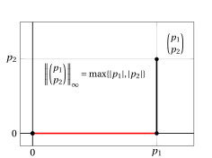{ .fig .ovale loading=lazy style="width:67%" }

- In due dimensioni, tutti i punti con norma \(\ell_\infty\) minore o uguale a 1

    $$
    \{{{{\boldsymbol x}}} \in \mathbb{R}^2 : \|{{{{\boldsymbol x}}}}\|_\infty \le 1\}
    $$

    sono i punti che giacciono sul bordo o all'interno di un <strong>quadrato</strong> (con lati paralleli agli assi) centrato nell'origine.

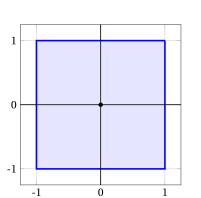{ .fig .ovale loading=lazy style="width:55%" }

### 5.1 Proprietà

- La norma \(\ell_\infty\) soddisfa le tre proprietà fondamentali che definiscono una norma.

!!! teorema "Osservazione 13: Non negatività e definitezza"

    Per ogni vettore colonna ${\boldsymbol p} \in \mathbb{R}^{n}$, si ha:

    \begin{equation}
    \|{\boldsymbol p}\|_\infty \ge 0
    \quad \text{e} \quad 
    \|{\boldsymbol p}\|_\infty = 0 \Longleftrightarrow {\boldsymbol p} = {\boldsymbol 0}
    \label{linf_prop1}
    \end{equation}

??? dimostrazione "Dimostrazione"

    Dalla definizione, \(\|{\boldsymbol p}\|_\infty = \max\{|p_j| : j \in \{1,2,\ldots,n\}\}\).

    1. <strong>Non negatività</strong>: poiché \(|p_j| \ge 0\) per ogni \(j \in \{1,2,\ldots,n\}\) e il massimo di numeri non negativi è non negativo, si ha

        $$
        \|{\boldsymbol p}\|_\infty = \max\{|p_j| : j \in \{1,2,\ldots,n\}\} \ge 0
        \quad \text{per ogni } {\boldsymbol p} \in \mathbb{R}^n.
        $$

    2. <strong>Definitezza</strong>:

        - **(\(\Rightarrow\))** Se \(\|{\boldsymbol p}\|_\infty = 0\), allora

            $$
            \max\{|p_j| : j \in \{1,2,\ldots,n\}\} = 0.
            $$

            Poiché

            $$
            |p_j| \le \max\{|p_k| : k \in \{1,2,\ldots,n\}\} {\rm~~per~ogni~~} j \in \{1,2,\ldots,n\},
            $$

            segue che

            $$
            |p_j| \le 0 \text{ per ogni } j \in \{1,2,\ldots,n\}.
            $$

            Ma \(|p_j| \ge 0\) vale sempre, quindi \(|p_j| = 0\) per ogni \(j\), cioè \(p_j = 0\) per ogni \(j \in \{1,2,\ldots,n\}\), e pertanto \({\boldsymbol p} = {\boldsymbol 0}\).

        - **(\(\Leftarrow\))** Se \({\boldsymbol p} = {\boldsymbol 0}\), allora \(p_j = 0\) per ogni \(j \in \{1,2,\ldots,n\}\), quindi

            $$
            \|{\boldsymbol p}\|_\infty = \max\{|0| : j \in \{1,2,\ldots,n\}\} = 0.
            $$

    
□

!!! teorema "Osservazione 14: Omogeneità assoluta"

    Per ogni scalare $\lambda \in \R$ e ogni vettore colonna ${\boldsymbol p} \in \mathbb{R}^{n}$, si ha:

    \begin{equation}
    \|\lambda \; {\boldsymbol p}\|_\infty = |\lambda| \;\| {\boldsymbol p}\|_\infty
    \label{linf_prop2}
    \end{equation}

??? dimostrazione "Dimostrazione"

    Per ogni scalare \(\lambda \in \R\) e ogni vettore colonna \({\boldsymbol p} \in \mathbb{R}^{n}\), si ha:

    \begin{align*}
    \|\lambda \; {\boldsymbol p}\|_\infty &= \max\{|\lambda \; p_j| : j \in \{1,2,\ldots,n\}\} \\[2ex]
    &= \max\{|\lambda| \; |p_j| : j \in \{1,2,\ldots,n\}\} \quad \text{(proprietà del valore assoluto)} \\[2ex]
    &= |\lambda| \max\{|p_j| : j \in \{1,2,\ldots,n\}\} \quad \text{(si porta la costante fuori dal max)} \\[2ex]
    &= |\lambda| \;\| {\boldsymbol p}\|_\infty
    \end{align*}

    
□

!!! teorema "Osservazione 15: Disuguaglianza triangolare"

    Per ogni coppia di vettori colonna ${\boldsymbol p},{\boldsymbol w} \in \mathbb{R}^{n}$, si ha:

    \begin{equation}
    \|{\boldsymbol p} + {\boldsymbol w}\|_\infty \le \|{\boldsymbol p}\|_\infty + \|{\boldsymbol w}\|_\infty
    \label{linf_prop3}
    \end{equation}

??? dimostrazione "Dimostrazione"

    Per ogni coppia di vettori \({\boldsymbol p}, {\boldsymbol w} \in \mathbb{R}^n\), si ha:

    \begin{align*}
    \|{\boldsymbol p} + {\boldsymbol w}\|_\infty 
    &= \max\{|p_j + w_j| : j \in \{1,2,\ldots,n\}\} \\[2ex]
    &\le \max\{|p_j| + |w_j| : j \in \{1,2,\ldots,n\}\} ~ \text{(disug. triang. per il valore ass.)} \\[2ex]
    &\le \max\{|p_j| : j \in \{1,2,\ldots,n\}\} + \max\{|w_j| : j \in \{1,2,\ldots,n\}\} ~ \text{(proprietà del max)} \\[2ex]
    &= \|{\boldsymbol p}\|_\infty + \|{\boldsymbol w}\|_\infty
    \end{align*}

    dove nella seconda disuguaglianza abbiamo usato il fatto che

    $$
    |p_j| \le \max\{|p_k| : k \in \{1,2,\ldots,n\}\}
    $$

    e

    $$
    |w_j| \le \max\{|w_k| : k \in \{1,2,\ldots,n\}\} \quad {\rm ~per~ogni~} j \in \{1,2,\ldots,n\}.
    $$

    
□

## 6. Confronto tra le norme $\ell_1$, $\ell_2$ e $\ell_\infty$

- Le norme \(\ell_1\), \(\ell_2\) e \(\ell_\infty\) di uno stesso vettore sono, in generale, numeri diversi. Tuttavia, sono legate da semplici disuguaglianze.

!!! teorema "Osservazione 16: Disuguaglianze tra norme"

    Per ogni vettore colonna ${\boldsymbol p} \in \mathbb{R}^{n}$, si ha:

    \begin{equation}
    \|{\boldsymbol p}\|_\infty \le \|{\boldsymbol p}\|_2 \le \|{\boldsymbol p}\|_1 \le n \, \|{\boldsymbol p}\|_\infty
    \label{norm_ineq_chain}
    \end{equation}

    e

    \begin{equation}
    \|{\boldsymbol p}\|_1 \le \sqrt{n} \; \|{\boldsymbol p}\|_2
    \label{norm_ineq_sqrtn}
    \end{equation}

??? dimostrazione "Dimostrazione"

    Sia \(k \in \{1,2,\ldots,n\}\) un indice tale che \(|p_k| = \|{\boldsymbol p}\|_\infty\).

    1. \(\|{\boldsymbol p}\|_\infty \le \|{\boldsymbol p}\|_2\): poiché tutti i termini \(p_j^2\) sono non negativi, si ha

        $$
        \|{\boldsymbol p}\|_\infty^2 = p_k^2 \le \sum_{j=1}^n p_j^2 = \|{\boldsymbol p}\|_2^2
        $$

        e, estraendo la radice quadrata di entrambi i membri (non negativi), \(\|{\boldsymbol p}\|_\infty \le \|{\boldsymbol p}\|_2\).

    2. \(\|{\boldsymbol p}\|_2 \le \|{\boldsymbol p}\|_1\): sviluppando il quadrato della somma, si ha

        $$
        \|{\boldsymbol p}\|_1^2 = \left(\sum_{j=1}^n |p_j|\right)^2 = \sum_{j=1}^n |p_j|^2 + \underbrace{\sum_{i=1}^n \sum_{\substack{j=1 \\ j \neq i}}^n |p_i| \, |p_j|}_{\ge 0} \ge \sum_{j=1}^n p_j^2 = \|{\boldsymbol p}\|_2^2
        $$

        e, estraendo la radice quadrata di entrambi i membri (non negativi), \(\|{\boldsymbol p}\|_2 \le \|{\boldsymbol p}\|_1\).

    3. \(\|{\boldsymbol p}\|_1 \le n \, \|{\boldsymbol p}\|_\infty\): poiché \(|p_j| \le \|{\boldsymbol p}\|_\infty\) per ogni \(j \in \{1,2,\ldots,n\}\), si ha

        $$
        \|{\boldsymbol p}\|_1 = \sum_{j=1}^n |p_j| \le \sum_{j=1}^n \|{\boldsymbol p}\|_\infty = n \, \|{\boldsymbol p}\|_\infty
        $$

    4. \(\|{\boldsymbol p}\|_1 \le \sqrt{n} \, \|{\boldsymbol p}\|_2\): consideriamo i vettori colonna

        $$
        {\boldsymbol a} = \begin{pmatrix} |p_1| \\ |p_2| \\ \vdots \\ |p_n| \end{pmatrix} \in \mathbb{R}^n
        \qquad \text{e} \qquad
        {\boldsymbol 1} = \begin{pmatrix} 1 \\ 1 \\ \vdots \\ 1 \end{pmatrix} \in \mathbb{R}^n
        $$

        per i quali \({\boldsymbol 1}' \, {\boldsymbol a} = \|{\boldsymbol p}\|_1\), \(\|{\boldsymbol a}\|_2 = \|{\boldsymbol p}\|_2\) e \(\|{\boldsymbol 1}\|_2 = \sqrt{n}\). Per la disuguaglianza di Cauchy–Schwarz \(\eqref{norm_2}\), otteniamo

        $$
        \|{\boldsymbol p}\|_1 = {\boldsymbol 1}' \, {\boldsymbol a} \le |{\boldsymbol 1}' \, {\boldsymbol a}| \le \|{\boldsymbol 1}\|_2 \; \|{\boldsymbol a}\|_2 = \sqrt{n} \; \|{\boldsymbol p}\|_2
        $$

    
□

!!! esempio "Esempio 11: disuguaglianze tra norme"

    Consideriamo il vettore:

    $$
    {\boldsymbol p} = \begin{pmatrix} 1 \\ -2 \\ 2 \end{pmatrix} \in \mathbb{R}^{3}
    $$

    Le sue norme sono:

    $$
    \|{\boldsymbol p}\|_\infty = \max\{1, 2, 2\} = 2, \qquad
    \|{\boldsymbol p}\|_2 = \sqrt{1 + 4 + 4} = 3, \qquad
    \|{\boldsymbol p}\|_1 = 1 + 2 + 2 = 5
    $$

    e, con \(n = 3\), si ha:

    $$
    \underbrace{2}_{\|{\boldsymbol p}\|_\infty} \le \underbrace{3}_{\|{\boldsymbol p}\|_2} \le \underbrace{5}_{\|{\boldsymbol p}\|_1} \le \underbrace{6}_{3 \, \|{\boldsymbol p}\|_\infty}
    \qquad \text{e} \qquad
    \underbrace{5}_{\|{\boldsymbol p}\|_1} \le \underbrace{3\sqrt{3}}_{\sqrt{3} \, \|{\boldsymbol p}\|_2} \approx 5.196
    $$

- In due dimensioni, le disuguaglianze \(\|{\boldsymbol x}\|_\infty \le \|{\boldsymbol x}\|_2 \le \|{\boldsymbol x}\|_1\) significano che le tre palle unitarie sono annidate: il rombo \(\ell_1\) è contenuto nel cerchio unitario \(\ell_2\), che a sua volta è contenuto nel quadrato \(\ell_\infty\).

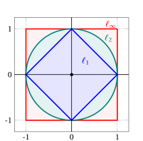{ .fig .ovale loading=lazy style="width:55%" }

!!! interattivo "Provalo nel laboratorio"

    lo stesso calcolo passo per passo: cambia la matrice e guarda come cambiano i passaggi.

## Esercizi e laboratorio

- :material-pencil-box-multiple: **Esercizi** · [il foglio di esercizi di questo capitolo: 12 esercizi con le soluzioni svolte](../esercizi/es-norme-01-norme.md)
- :material-calculator-variant: **Laboratorio** · [Norme](../laboratorio/norme.md) — Le norme \(\ell_1\), \(\ell_2\), \(\ell_\infty\) e quella generalizzata da \(\boldsymbol Q\).

